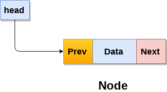

# Estructuras de Datos
## ¿Qu&eacute; es una estructura de datos?
Una estuctura de datos es una forma particular de organizar informaci&oacute;n en la computadora, de tal suerte que est&aacute; puede ser utilizada posteriormente de manera eficaz.

Entre las estructuras de datos b&aacute;sicas se encuentran:
- Array (Listas o Arreglos)
- Linked List (Ligadas ligadas)
- Stack (pilas)
- Queue (colas)
- Binary Tree (Arboles binarios)
- Binary Search Tree (Arboles de busqueda binaria) 
- Heap (Monticulos)
- Hashing 
- Graph (Grafos)
- Matrix (Matriz)
- Entre otras, que son mezcla o versiones m&aacute;s avanzadas.

## Estructuras de datos lineales
Empezaremos con las estructuras de datos lineales.

- Array (Lista o Arreglo)
- Linked List (Ligada ligada)
- Stack (pila)
- Queue (cola)

## Array (Arreglos)

Un Array es una estructra de datos usada para guardar elementos del mismo tipo en ubicaciones de memoria contigua. Esta estructura de datos es posiblemente la más utilizada. Una caracteristica escencial de los arreglos es que el tamaño del arreglo debe definirse antes de utilizarlo.


*Image from www.javatpoint.com*

```
Byte address of element A[i]  = base address + size * ( i - first index)   
```

Consideremos un arreglo de tama&ntilde;o `n`.

### Complejidad de operaciones en un arreglo
---
**Tiempo de acceso:** `O(1)` [Solo posible cuando/porque la memoria es contigua]

**Tiempo de busqueda:**  `O(n)`(para el caso secuencial) y `O(log n)` (para busqueda binaria [Solo cuando la busqueda es sobre un arreglo ordenado])

**Tiempo de inserci&oacute;n:** `O(n)` [El peor de los casos ocurre cuando la inserci&oacute;n ocurre al inicio de un arreglo y se requiere intercambiar la posici&oacute;n de todos los elementos.]

**Tiempo de borrado:** `O(n)` [El peor de los casos ocurre cuando el borrado ocurre al inicio de un arreglo y se requiere intercambiar la posici&oacute;n de todos los elementos.]

| Algoritmo     | Caso Promedio | Peor caso |
| ------------- |---------------| ----------|
| Acceso        | O(1)          | O(1)      |
| Busqueda      | O(n)          | O(n)      |
| Inserción     | O(n)          | O(n)      |
| Borrado       | O(n)          | O(n)      |

Ejemplo: Digamos que deseamos guardar las calificaciones de todos los estudiantes de este grupo, por supuesto podemos guardarlos en un arreglo. 

```
#include <stdio.h>

int main(int argc, char *argv[]){
    float A[10];
    int numeroDeEstudiantes = 10;
    for(int i=0;i<numeroDeEstudiantes; ++i){
        A[i] = 0.0;
    }
    A[0] = 8.5;
    A[1] = 8.6;
    A[2] = 8.7;
    A[3] = 8.8;
    A[4] = 8.9;
    A[5] = 9.0;
    A[6] = 9.1;
    A[7] = 9.2;
    A[8] = 9.3;
    A[9] = 9.4;
    for(int i=0;i<numeroDeEstudiantes; ++i){
        prinf("Calificacion de estudiante con id= %d es %f\n", i+1, A[i]);
    }
    return 0;
}
```
### Arreglos Bidimensionales
```
int arr[max_rows][max_columns];
```


*Image from www.javatpoint.com*


## Linked List (Lista Ligada)
 Una lista ligada es una estructura lineal de informaci&oacute;n, muy parecida a los arreglos donde cada elemento es un objeto separado llamado **nodo** usualmente conformado por dos elementos, el primero la informaci&oacute;n dentro del nodo y una referencia al siguiente nodo.


*Image from www.javatpoint.com*

```
struct node
{  
    int data;
    struct node *next;
};  
struct node *head, *ptr;
ptr = (struct node *)malloc(sizeof(struct node *));  
```

### Tipos de listas ligadas
Tenemos escencialmente 3 tipos de listas ligadas:

1. Listas simplemente ligadas:  En este tipo de listas ligadas cada nodo guarda la direcci&oacute;n o referencia del siguiente nodo en la lista, adem&aacute;s el &uacute;ltimo nodo tiene como direcci&oacute;n o referencia el elemnto nulo `NULL`. Un ejemplo de lista ser&iacute;a 1->2->3->4->5->`NULL`.


*Image from www.javatpoint.com*

2. Lista doblemente ligada : En este tipo de lista ligada, hay dos referencias asociadas a cada nodo, una referencia que apunta hacia el siguiente nodo y otra que apunta al anterior. Por lo cual es facil recorrerlas en cualquiera de los dos sentidos. Un ejemplo de este tipo de lista seria:  `NULL`<-1<->2<->3<->4<->5->`NULL`, usualmente se define un tipo especial de nodo llamado `head` (cabeza) cuya tarea es indicar la direcci&oacute;n del primer nodo, asi la lista anterior se ve como: 1<->2<->3<->4<->5->`NULL`.

*Image from www.javatpoint.com*

```
struct node   
{  
    struct node *prev;   
    int data;  
    struct node *next;   
}  
```


*Image from www.javatpoint.com*

3. Lista ligada circular. La lista ligada circular es una lista ligada donde todos los elementos estan conectados en forma de circulo, es decir, no hay un elemento nulo (`NULL`) al inicio o al final de dicha lista. Una lista ligada circularmente puede ser simplemente ligada o doblemente ligada. Aqui cualquier elemento puede ser el nodo inicial. Esto es &uacute;til en la implementaci&oacute;n de colas circulares en listas ligadas. Un ejemplo de lista ligada circularmente es: 1->2->3->4->5->1


### Complejidad de listas ligadas

Complejidad de acceso a un elemento: `O(n)`
Complejidad de busqueda de un elemento: `O(n)`
Complejidad de insercion de un elemento: `O(1)` [Si ya estamos en la posicion donde se insertar&aacute;.]
Complejidad de borrado de un elemento: `O(1)` [Si estamos ubicados en una posici&oacute;n anterior a la del elemento por ser borrado.]

**¿Cu&aacute;l es la ventaja o desventaja de usar listas ligadas en el ejemplo de las calificaciones?**
