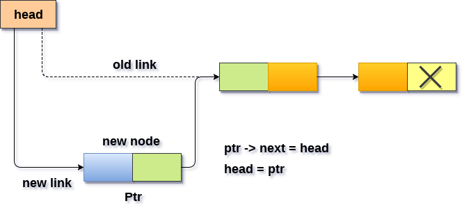

# Estructuras de Datos
## Sesion 04

## Revisi&oacute;n de ejercicios de sesi&oacute;n de pr&aacute;ctica

[Codigo](practicas/sesion_04_practica_01.cpp)

Considerando la siguiente estructura `Node`
```
template <typename T>
struct Node{
    T data;
    Node *next;
    Node(){
        this->data = 0;
        this->next = NULL;
    }
    Node(T &val){
        this->data = val;
        this->next = NULL;
    }
};
```

## Inserción en una lista simplemente ligada al principio
La sesi&oacute;n anterior agregamos la siguiente funcionalidad:
- inserción al inicio: `PushFront(head, val)`
```
template <typename T>
Node<T> *PushFront(Node<T> *ptrHead,const T &val){
    Node<T> *newNode = new Node<T>;
    newNode->data = val;
    newNode->next = ptrHead;
    return newNode;
}
```
Hoy agregaremos mas detalles a la implementaci&oacute;n, para que sea muy claro que est&aacute; sucediendo.

Para insertar un nuevo elemento en una lista simplemente ligada al inicio es bastante simple. Solo necesitamos hacer algunos ajustes en los enlaces de nodo. 

- Allocamos el espacio para el nuevo nodo y almacenamos datos en la parte de datos del nodo. 
```
    Node<T> *newNode = new Node<T>;
    newNode->data = val;
    newNode->next = ptrHead;
```
- Hacemos que el enlace forme parte del nuevo nodo apuntando al primer nodo existente de la lista. 

```
    newNode->next = ptrHead;
```
- Por último, hacemos que el nuevo nodo sea el primer nodo de la lista. En nuestro c&oacute;digo esto es desde la funci&oacute;n principal `main`:
```
    ptrHead = PushFront(ptrHead, val);
```

El algoritmo ser&iacute;a descrito graficamente de la siguiente manera:


*Image from www.javatpoint.com*


- inserción de nodo en posición arbitraria: `Insert(head, val)`
```
template <typename T>
Node<T> *Insert(Node<T> *ptrHead,const T &val, int pos){
    if(pos == 0){
        ptrHead = PushFront(ptrHead,val);
        return ptrHead;
    }
    int contador = 0;
    Node<T> *tempNode = ptrHead;
    Node<T> *prevNode = tempNode;
    while(tempNode != NULL && contador < pos){
        prevNode = tempNode;
        tempNode = tempNode->next;
        contador++;
    }
    if(contador == pos){
        Node<T> *newNode = new Node<T>;
        newNode->data = val;
        newNode->next = tempNode;
        prevNode->next = newNode;
        std::cout << "El valor lista[" << pos <<"] es: "   << tempNode->data << std::endl;
        std::cout << "El valor lista[prevNode] es: "   << prevNode->data << std::endl;
    }else{
        std::cout << "Posicion no encontrada" << std::endl;
    }
    return tempNode;
}
```
- borrar nodo al inicio y retornar valor dentro de nodo: `PopFront(head)`
```
template <typename T>
Node<T>* PopFront(Node<T> *ptrHead, Node<T>* ptrPopNode){
    if (ptrHead == NULL){
        std::cout << "Lista vacia operacion no valida" << std::endl;
        return NULL;
    }
    Node<T>* newHead = ptrHead->next; 
    std::cout << prtHead->data << std::endl;
    return tempNode;
}
```
- borrar nodo al final y retornar valor dentro de nodo: `PopBack(head)`
```
template <typename T>
Node<T>* PopFront(Node<T> *ptrHead){
    if (ptrHead == NULL){
        std::cout << "Lista vacia operacion no valida" << std::endl;
        return NULL;
    }
    Node<T>* tailNode = ptrHead;
    Node<T>* tempNode = ptrHead->next;
    while(tempNode != NULL){
        tailNode = tempNode;
        tempNode = tempNode->next
    } 
    std::cout << tail->data << std::endl;
    free(prtHead);
    return tempNode;
}
```
- borrar nodo en posicion arbitraria: `Delete(head, pos)`
- crear función que regrese nodo en posición( si la posición excede el número de elemntos en la lista ligada deberá regresar `NULL`): `Position(head, pos)`
- crear función para buscar la primer ocurrencia de un valor `val` dentro de la lista ligada: `Search(head, val)`
- crear constructor en estructura nodo que imprima "Nodo Creado"
```
Node(){
    this->data = 0;
    this->next = NULL;
    std::cout << "Nodo Creado" << std::endl;
}
```
Si tenemos otro constructor, simplemente modificarlo
```
Node(T &val){
    this->data = val;
    this->next = NULL;
    std::cout << "Nodo Creado" << std::endl;
}
```


- crear destructor en estructura nodo que imprima "Nodo Borrado"
- sobrecargar operador `[]` para acceder directamente a un nodo por posición
- sobrecargar operador `<<` para poder imprimir el contenido dentro de la estructura nodo.

## Unit Testing (TDD)

[Visual Studio](https://docs.microsoft.com/en-us/visualstudio/test/writing-unit-tests-for-c-cpp?view=vs-2019)
Visual Studio includes these C++ test frameworks with no additional downloads required:

- Microsoft Unit Testing Framework for C++
- Google Test
- Boost.Test
- CTest

[Codebocks](http://wiki.codeblocks.org/index.php/UnitTesting)

## Biblioteca de trabajo 

Vamos a empezar a crear una peque&ntilde;a bibioteca para este curso en [DS2020](./DS2020) cada quien deberia
crear su propia bibioteca o usar est&aacute;, al final del curso compararemos el rendimiento de esta biblioteca contra la librer&iacute;a estandar.

Algunas  de las consideraciones que deber&aacute;n cumplir son:
- Deber&aacute;n manejar excepciones.
- Crear arbol de subdirectorios.
- Nombrar con mayusula cada una de las clases y folders.

## Stack (Pila)

Un stack o LIFO (last in, first out) es un tipo de dato abstracto que sirve como una colecci&oacute;n de elementos, que tiene dos operaciones.
- `push` agrega un elemento a la colecci&oacute;n .
- `pop` remueve el &uacute;ltimo elemento que fue agregado.

Ambas operaciones traajan sobre el mismo elemento que es el que se encuentra al final y mas arriba en el stack (pila).

Para implementar una pila podemos utilizar tanto un arreglo como una lista ligada.

### Complejidad de los stacks
| Algoritmo     | Caso Promedio | Peor caso |
| ------------- |---------------| ----------|
| Acceso        | O(n)          | O(n)      |
| Busqueda      | O(n)          | O(n)      |
| Inserción     | O(1)          | O(1)      |
| Borrado       | O(1)          | O(1)      |

Inserci&oacute;n : `O(1)` Tanto utilizando arreglos como listas ligadas mantenemos un apuntador/indicador que nos dice la posici&oacute;n del &uacute;ltimo elemento que es donde se agregar&aacute; el nuevo.

Borrado :  `O(1)` Tanto utilizando arreglos como listas ligadas mantenemos un apuntador/indicador que nos dice la posici&oacute;n del &uacute;ltimo elemento que es donde se borrar&aacute;.

Acceso : `O(n)` [Peor de los casos] 

Tanto la inserci&oacute;n como el borrado solo se permiten al final.

Uno de los usos m&aacute;s comunes de los stacks es para remover recursiones de un programa. Si recuerdan como funciona una recursi&oacute;n el &uacute;ltimo programa en ser llamado deber ser el primero en terminar. 
