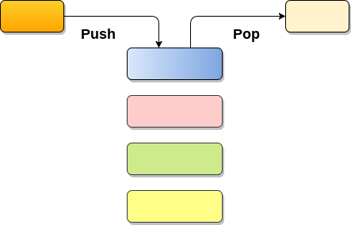
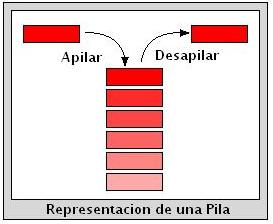
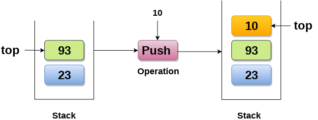
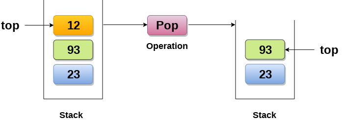
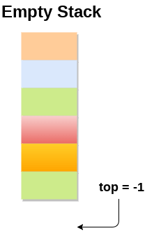
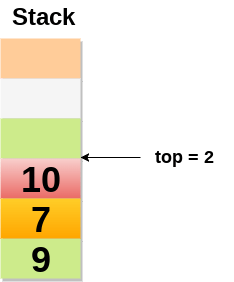
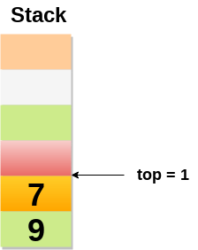
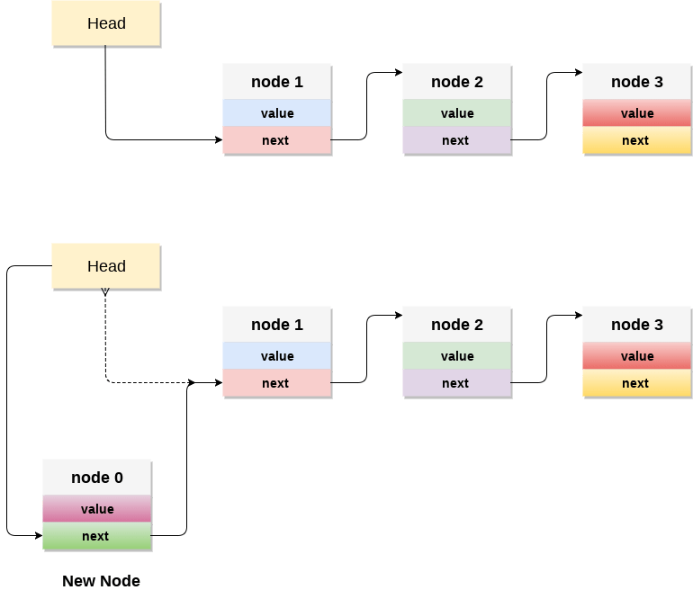

# Estructuras de Datos
## Sesión 5

## Stack (Pila parte 2)

Recordando el material de la clase pasada:

Un **stack** que trabaja bajo **LIFO (last in, first out)** por lo cual es conmunmente llamada una **lista LIFO** es un tipo de dato abstracto que 
sirve como una colecci&oacute;n de elementos, que tiene dos operaciones básicas.
- `push` agrega un elemento a la colecci&oacute;n.
- `pop` remueve el &uacute;ltimo elemento que fue agregado.
- `peek` accesar el &uacute;ltimo elemento de la pila sin borrar el elemento.

***Image from www.javapoint.com*

Ambas operaciones trabajan sobre el mismo elemento que es el que se encuentra al final y más arriba en el stack (pila) y es llamado `top`.

**Image from https://blog.martincruz.me/2012/10/pilas-en-c.html**

Para implementar una pila podemos utilizar tanto un arreglo como una lista ligada.

### Complejidad de los stacks
| Algoritmo     | Caso Promedio | Peor caso |
| ------------- |---------------| ----------|
| Acceso        | O(n)          | O(n)      |
| Busqueda      | O(n)          | O(n)      |
| Inserción     | O(1)          | O(1)      |
| Borrado       | O(1)          | O(1)      |

Inserci&oacute;n : `O(1)` Tanto utilizando arreglos como listas ligadas mantenemos un apuntador/indicador que nos dice la posici&oacute;n del &uacute;ltimo elemento que es donde se agregar&aacute; el nuevo.

Borrado :  `O(1)` Tanto utilizando arreglos como listas ligadas mantenemos un apuntador/indicador que nos dice la posici&oacute;n del &uacute;ltimo elemento que es donde se borrar&aacute;.

Acceso : `O(n)` [Peor de los casos] 

Tanto la inserci&oacute;n como el borrado solo se permiten al final.

### Como incrementamos o decrementamos un stack

- Cuando el stack es vacio el valor de `top` es designado como -1.

- Cuando el stack no se encuentra vacio el valor de `top` corresponde con el n&uacute;mero de elemntos del stack.

- Cuando un elemento es borrado del stack simplemente restamos uno a `top`.

Valores especiales de `top`
- -1 :	Vacio
- 0  :	Un solo elemento
- N-1:	Stack se encuentra lleno
- N  :	Overflow

### Aplicaciones de stacks

Uno de los usos m&aacute;s comunes de los stacks es para remover recursiones de un programa. Si recuerdan como funciona una recursi&oacute;n el &uacute;ltimo programa en ser llamado deber ser el primero en terminar, es natural pensar que los stacks son utilizados para crear dichas recursiones. En general podemos agrupar las aplicaciones de stacks como:

- Recursion
- Parseo
- Evaluaci&oacute;n de expresiones
- Editores

### Implementacion de stacks con arreglos

La clase pasada vimos como crear las funciones `pop` y `push` hoy agregaremos `peek`.

### Implementacion de stacks con listas ligadas
Aqui tenemos varias maneras de implementar un `stack`, como podria ser mantener un apuntador al &uacute;ltimo elemento de la lista

sin embargo, tal vez la m&aacute;s usual sea manejar el `top` como el primer nodo de la lista, es decir, `head` ser&iacute;a el marcador `top` de nuestro `stack`, y las operaciones se realizan siempre sobre `head`.

- `push`: Insertamos nodos nuevos siempre al inicio de nuestra lista ligada. 

- `pop`: Borramos siempre al inicio de nuestra lista ligada.

- `peek`: Ponemos el apuntador siempre al inicio de nuestra lista ligada.

## Queue (Colas)

Una queue (cola) o FIFO (first in, first out) es un tipo de dato abstracto que sirve como una colecci&oacute;n de elementos, que tiene dos operaciones b&aacute;sicas:
- enqueue:  Agregar un elemento a la colecci&oacute;n por la parte final.
- dequeue: Remover el elemento del inicio.

Al igual que el stack se puede implementar ya sea usando arreglos o listas ligadas. Con la unica diferencia de que insertamos al final de la lista ligada. Como  pueden imaginarse la implementaci&oacute;n es muy parecida. 

Vamos a hacerla como ejercicio en lo que queda de la clase.

### Complejidad
Insercion : `O(1)`

Borrado  : `O(1)`

Acceso : `O(n)` [En el peor de los casos]

Ejemplos:
- Filas de atenci&oacute;n a clientes
- Manejo de recursos del sistema:
    - impresores
    - CPU
    - discos
- transferencia de datos(de manera asincrona, i.e. paginado)
- buffers son implementados con queue
- El caso particular de colas circulares es para evitar desperdiciar memoria.
