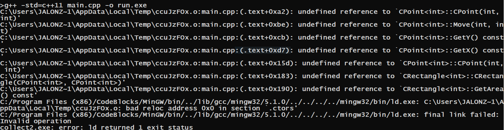

# Sesión 06


## Stacks practica
La sesión pasada asi como en su tarea \#2 quedo de ejercicio implementar varios metodos para su clase stack. Revisemos el ejercicio antes de continuar:

[stack parte 1](./codigos/clase_06_practica_01.cpp)

[stack parte 2](./codigos/clase_06_practica_02.cpp)

Ahora estamos casi listos para empezar nuestra biblioteca DS2020,
para poder continuar veremos algunos por menores de compilacón de templates.

---

## Compilación

Para todos los que no recuerdan como funciona la compilación en C++, les recomiendo revisar a fondo la siguiente sección. Solo llevaremos a cabo un breve recordatorio.


---

## Compilación y comunes errores con templates

Hay 4 etapas principales involucradas en la creación de un archivo ejecutable desde el archivo fuente.

1. El preprocesador de C ++ toma un archivo de código fuente de C++ y se ocupa de los encabezados (#include), macros (#define) y otras directivas de preprocesador.

2. El archivo de código fuente expandido de C++ producido por el preprocesador de C++ se compila en el lenguaje ensamblador de la plataforma.

3. El código de ensamblador generado por el compilador se ensambla en el código de objeto para la plataforma.(a veces llamado **Montaje**)

4. El archivo de código de objeto producido por el ensamblador está vinculado entre sí con los archivos de código de objeto para cualquier función de biblioteca utilizada para producir una biblioteca o un archivo ejecutable.(a veces llamado **Enlace**)

---

### Ejemplo 1: Como compilar proyecto con multiples archivos(Recordatorio)

El programa consistirá de 3 archivos:

- [main.cpp](./codigos/clase_06_ejemplo_00/main.cpp), programa principal.
- [lib1.h](./codigos/clase_06_ejemplo_00/lib1.h), archivo de cabecera(header file) para la clase Point.
- [lib1.cpp](./codigos/clase_06_ejemplo_00/lib1.cpp), archivo de implementación(implementation file) para la `lib1.h`.
```
g++ -std=c++11 main.cpp -o run.exe
```
General el siguiente codigo
```
...\AppData\Local\Temp\cc0kid7e.o:main.cpp:(.text+0xc): undefined reference to `mi_funcion()'
collect2.exe: error: ld returned 1 exit status
```

La forma simple de corregir esto es agregar las dependencias al momento de compilar:

```
g++ -std=c++11 main.cpp lib1.cpp -o run.exe
```

Lo que esta haciendo implicitamente es generar el codigo objecto para ambos archivos(paso 3: generación de código objeto) y despues usa para generar el ejecutable(paso 4: vinculación para generar ejecutable) :
```
g++ -std=c++11 -c main.cpp
g++ -std=c++11 -c lib1.cpp
g++ -std=c++11 -o run.exe main.o lib1.o 
```

---

### Ejemplo 2: Compilación con templates

El programa consistirá de 5 archivos:

- [main.cpp](./codigos/clase_06_ejemplo_01/main.cpp), programa principal.
- [Point.h](./codigos/clase_06_ejemplo_01/Point.h), archivo de cabecera(header file) para la clase Point.
- [Point.cpp](./codigos/clase_06_ejemplo_01/Point.cpp), archivo de implementación(implementation file) para clase Point.
- [Rectangle.h](./codigos/clase_06_ejemplo_01/Rectangle.h), archivo de cabecera(header file) para la clase Rectangle.
- [Rectangle.cpp](./codigos/clase_06_ejemplo_01/Rectangle.cpp), archivo de implementación(implementation file) para clase Rectangle.

pueden acceder a ellos en `codigos/clase_06_ejemplo_01`.

Si intentamos compilar directamente `main.cpp`:

```
g++ -std=c++11 main.cpp -o run.exe
```

obtenemos



Esto es por que no existen las referencias a los codigos objeto de `Point.cpp` y `Rectangle.cpp`. Bien el primer impulso seria cambiar la orden de compilación como lo hicimos en el ejemplo anterior:

```
g++ -std=c++11 main.cpp Point.cpp Rectangle.cpp -o run.exe
```

La falla se debe a que cada una de los archivos `Point.cpp` y `Rectangle.cpp` son compilados pero a priori no se genera `CPoint<int>` o cualquier otra instancia expecifica de `CPoint` como `CPoint<float>` almenos que dentro de cada archivo `cpp` sea utilizado o forzada la creación de dichas implementaciones en código objecto(instancias), otra alternativa es simplemente poner la implementación de las clases dentro del archivo `.h` y no utilizar arhivos `.cpp` cuando usemos templates.

En el archivo `Point.cpp` agregamos al final:
```
template class CPoint<int>;
```

En el archivo `Rectangle.cpp` agregamos al final:
```
template class CRectangle<int>;
```

la forma correcta de realizar dicho build es:

```
g++ -std=c++11 main.cpp Point.cpp Rectangle.cpp -o run.exe
```

### Para compilar por separado cada archivo:
#### Montaje

---

Con la opción `-c` el ensamblador crea código objeto. En un sistema UNIX(o con el compilador gcc) puede ver estos archivos con un sufijo .o (archivos de código de objeto). En esta fase, el ensamblador convierte esos archivos de objeto de código de ensamblaje en instrucciones a nivel de máquina y el archivo creado es un código de objeto reubicable. Por lo tanto, la fase de compilación genera el programa de objeto reubicable y este programa se puede utilizar en diferentes lugares sin tener que compilar nuevamente!!!, esto nos ahorrara tiempo de compilacion en el futuro.

---

```
g++ -c main.cpp
g++ -c Point.cpp
g++ -c Rectangle.cpp
```
 Esto generará tres archivos objeto

```
main.o
Point.o
Rectangle.o
```

#### Enlace

---
El enlazador es lo que produce la salida de compilación final de los archivos de objetos que produjo el ensamblador. 

Vincula todos los archivos de objetos reemplazando las referencias a símbolos no definidos con las direcciones correctas. Cada uno de estos símbolos se puede definir en otros archivos de objetos o en otras bibliotecas. Si están definidas en bibliotecas distintas de la biblioteca estándar, se debe informar al vinculador sobre ellas.

En esta etapa, los errores más comunes son las definiciones faltantes o las definiciones duplicadas. Lo primero significa que las definiciones no existen (es decir, no están escritas), o que los archivos de objetos o las bibliotecas donde residen no se entregaron al vinculador. Lo último es obvio: el mismo símbolo se definió en dos archivos de objetos o bibliotecas diferentes.

---


Finalmente generamos el código ejecutable:

```
g++ -std=c++11 -o run.exe main.o Rectangle.o Point.o
```

Con esto en mente estamos listos para implementar nuestro primer contenedor en la biblioteca DS2020.

## Pilas: Creación de la librería para uso de Stacks

Con lo aprendido hasta el momento por que la  sería mala idea la siguiente implementación:

[Stack.h](./DS2020/Container/CStack.h)

[Stack.cpp](./DS2020/Container/CStack.cpp)

Ahora comparemos usando solo el archivo `.h`:

[Stack.h](./DS2020/Container/Stack.h)


---

## Creando un Makefile para un programa en general
### Crear make para windows

A partir de está clase empezaremos a utilizar la instrucción `mingw32-make.exe` provista en MinGW. Para que el uso sea más transparente entre diferentes sistemas operativos crearemos la siguiente copia de `mingw32-make.exe`:

```
copy c:\MinGW\bin\mingw32-make.exe c:\MinGW\bin\make.exe
```


