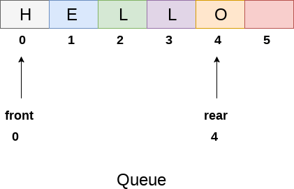
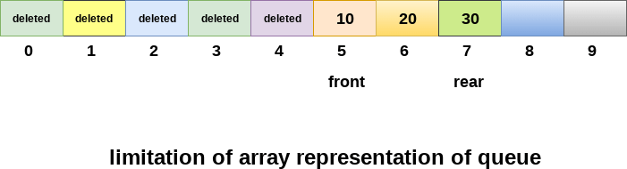
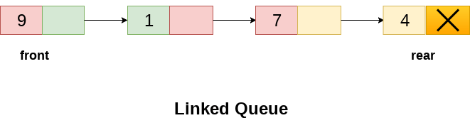

# Sesión 07

## Queue (Colas)

Una queue (cola) o FIFO (first in, first out) es un tipo de dato abstracto que sirve como una colecci&oacute;n de elementos, que tiene dos operaciones b&aacute;sicas:
- enqueue:  Agregar un elemento a la colecci&oacute;n por la parte final.
- dequeue: Remover el elemento del inicio.


Al igual que el stack se puede implementar ya sea usando arreglos o listas ligadas. Con la unica diferencia de que insertamos al final de la lista ligada. Como  pueden imaginarse la implementaci&oacute;n es muy parecida. 

### Complejidad
Insercion : `O(1)`

Borrado  : `O(1)`

Acceso : `O(n)` [En el peor de los casos]

Ejemplos:
- Filas de atenci&oacute;n a clientes
- Manejo de recursos del sistema:
    - impresores
    - CPU
    - discos
- transferencia de datos(de manera asincrona, i.e. paginado)
- buffers son implementados con queue
- El caso particular de colas circulares es para evitar desperdiciar memoria.

Vamos a hacerla como ejercicio en lo que queda de la clase.

## Implementación de Queue usando un arreglo



Usaremos un arreglo linear para llevar a cabo la implementación de la cola. Para ello definieremos dos variables, `front` y `rear`.
- Inicialmente `front` y `rear` es -1. Esto quiere decir que la cola es vacia.
- Cuando insertamos un valor por primera vez incrementamos tanto el valor de front como el de rear en una unidad y asignamos el valor en esta posición.
- Si `front` y `rear >= 0` entonces cuando insertamos un valor incrementamos `rear` asignamos el valor en esta posición.
- Cuando hacemos un `pop` retornamos el valor en la posicion `front` e incrementamos `front` en una unidad.

Dependiendo de su uso podrian usar memoria estatica o memoria dinamica, por el momento usaremos memoria dinamica, dejaré en una tarea posterior implementar esta estructura usando memoria estatica.
```
template <typename T>
class CQueue{
public:
    CQueue();
    CQueue(int iMax);
    CQueue(int iMax, T *array);
    ~CQueue();
    bool Push(const T &val);
    T Pop();
    T Print();
private:
    T *m_array;
    int m_iMax;
    int m_iFront;
    int m_iRear;
};

template <typename T>
void CQueue<T>::CQueue(){
    m_iMax = 100;
    m_iFront = -1;
    m_iRear = -1;
    m_array = new T[m_iMax];
}

template <typename T>
void CQueue<T>::~CQueue(){
    delete []m_array;
}
```

### Limitaciones de está implementación



- Desperdicio de memoria
- Tamaño del arreglo

## Implementación de Queue usando un listas ligadas



- Inicialmente `front` y `rear` son apuntadores que apuntan a `NULL`. Esto quiere decir que la cola es vacia.
- Cuando insertamos un valor por primera vez asignamos el valor del apuntador tanto `front` como a `rear`.
- Si `front` y `rear` son no nulos entonces cuando insertamos un valor, lo hacemos haciendo que `rear` apunte a un nuevo nodo con ese valor y actualizamos al dirreción de `rear`.
- Cuando hacemos un `pop` retornamos el valor en la posicion `front` y apuntamos `front` a `front->next`

Desarrollen el resto de la clase dicha implementación.