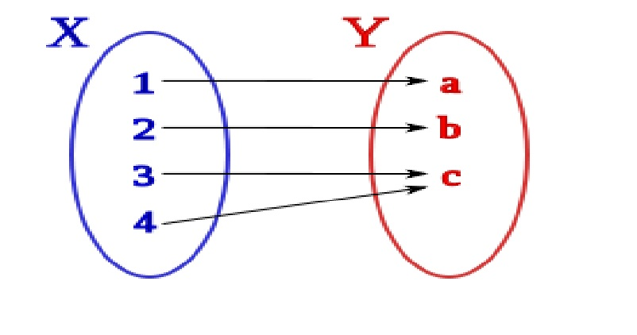
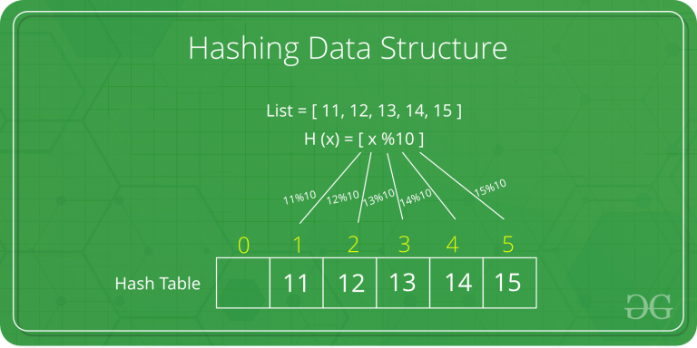

# Hash tables

Una `tabla hash` (`hashtable`), `matriz asociativa`, `hashing`, `mapa hash`, `tabla de dispersión` o `tabla fragmentada` es una estructura de datos que asocia llaves o claves con valores. La **operación principal** que soporta de manera eficiente es la **búsqueda**: permite el acceso a los elementos ( por ejemplo nombre de estudiante, semestre y promedio) almacenados a partir de una clave generada (número de estudiante). Funciona transformando la clave con una función hash en un hash, un número que identifica la posición (casilla o cubeta) donde la tabla hash localiza el valor deseado, es decir, una `hash table` es una estructura tambien llamada “arreglo asociativo”. Cuya función principal es asociar `llaves` o `keys` con `valores`.

Una `función hash` es aquella que recibe la llave(`key`) y de ahí le dice el índice de “cubetas” en las que está el valor.

Un `hash table` tiene un gran performance en  búsqueda, inserción y eliminación de objetos.

Las tablas hash se suelen implementar sobre **vectores de una dimensión**, aunque se pueden hacer implementaciones multi-dimensionales basadas en varias claves. Como en el caso de los arrays, las tablas hash proveen tiempo constante de búsqueda promedio $O(1)$,​ sin importar el número de elementos en la tabla. Sin embargo, en casos particularmente malos el tiempo de búsqueda puede llegar a $O(n)$, es decir, en función del número de elementos.

## Cuando son  más útiles y cuando no

 - Las tablas hash son más útiles cuando se almacenan grandes cantidades de información.
 -  Las tablas hashing se aplican cuando el conjunto de claves posibles es mucho mayor que el de claves reales a almacenar.

 - Las tablas hash almacenan la información en posiciones pseudo-aleatorias, así que el acceso ordenado a su contenido es bastante lento.


## ¿Qué son los datos dispersos?

Cuando hablamos de datos, podemos decir que tan dispersos son dependiendo que tan relacionados están entre ellos, cuando los datos no están proximos entre si es cuando decimos que están dispersos.

## Implementación de un hash table.
La eficiencia de un mapa depende de la función hash utilizada $H$.

Dado un conjunto de claves posibles, $X$, y un conjunto de direcciones de memoria, $D$, una función de transformación, $H(x)$, es una función suprayectiva del conjunto de claves posibles en el conjunto de direcciones de memoria.

$$ H:X\longrightarrow D $$



Por ejemplo:

Sea $H(x)$  una función hash que mapea el valor de $x$ al indice $x\%10$ dentro de un arreglo.

El arreglo
```
[11,12,13,14,15]
```
Sera guardado en el arreglo en las posiciones
```
{1,2,3,4,5}
```
del arreglo o tabla hash.


**Images from https://www.geeksforgeeks.org**

### Otro ejemplo de tabla hash

Supongamos que guardamos una lista de nombres, si hicieramos esta lista implementando una lista ligada, encontrar los datos un nombre intermedio nos tamaría en promedio `n` operaciones.

Usando un `hash table` tendríamos 26 cubetas(buckets) y nuestra función hash sería algo como:
```
int hash(const char *cadena){
	return (tolower(cadena[0])) - 'a';
}
```

Supongamos que tenemos tenemos una lista con 1000,000,000 de estudiantes. Analizamos el primero nombre de cada estudiante y resulta que tenemos 1000,000 de nombres distintos como primer nombre. Una forma de crear una tabla hash, seria utilizar dicho primer como llave(`key`).

¿Cuantás operaciones en promedio tendría que realizar para encontrar el nombre del estudiante en el bucket correspondiente?
R. 
- `m = Total de nombres`
- `s = Numero de cajas`
- `b = Espacio Promedio por caja`

$$ \alpha = \frac{m}{s\cdot b} $$

 En nuestro ejemplo:
 - `m = 1000,000,000`
 - `s = 1000,000`
 - `b = 1`
- Cuantos nombre habría por caja: 1000

## Operaciones

- Insertar: Llama a la función hash para saber en qué cubeta insertar.
- Find: Llama a la función hash para encontrar la cubeta con el elemento a buscar.
- FindAndRemove: Llama a la función hash para encontrar la cubeta con el elemento y quita el elemento de esa cubeta.


## Algunos conceptos básicos
- Se dice que dos claves distintas $x_{1}$ y $x_{2}$ son **sinónimas** para una función hash $H(x)$ si $H(x_{1}) = H(x_{2})$.
- Se dice que se ha producido un **desbordamiento** cuando una nueva clave se
aplica a una dirección de memoria completamente ocupada.
- Se dice que se ha producido una **colisión** cuando dos claves distintas se aplican sobre la misma celda.
- En el caso habitual en el que una celda contiene un único registro el desbordamiento y la colisión se producen simultáneamente.
- Se denomina **densidad de claves** al cociente entre el número de claves en uso, $m$, y el número total de llaves posibles, $n_{x}$, i.e.,$\frac{m}{n_{x}}$. 
- Se denomina **factor de carga**, (o densidad de carga), $\alpha$, al cociente entre el número de claves en uso y el número total de registros almacenables en la tabla de dispersión. Sea $s$ es el número de registros por bloque y $b$ es el número de bloques que hay en la tabla de dispersión entonces:

$$ \alpha = \frac{m}{s\cdot b}$$


## Practica

Vamos a convertir un arreglo a su forma reducida.
Dado un arreglo con $n$ elementos distintos convertir el arreglo a una forma donde todos sus elementos se encuentren en el rango $0$ a $n-1$. El orden de los elementos debe mantenerse. Por ejemplo el $0$ sera colocado en el lugar del elemento más pequeño, 1 en el segundo más pequeño, ..., $n-1$ es colocado en el lugar del elemento más grande.

```
Input:  arr[] = {10, 40, 20}
Output: arr[] = {0, 2, 1}

Input:  arr[] = {5, 10, 40, 30, 20}
Output: arr[] = {0, 1, 4, 3, 2}
```

### Metodo 1 (Simple)

Tal vez la más simple solución sea encontrar el elemento más pequeño y replazarlo por $0$ repetir el proceso para el resto de los elementos en el array. La complejidad de este algoritmo es $O(n^{2})$

[Implementacion](./codigos/clase_09_practica_01.cpp)

Si tenemos un 1000,000 y aplicamos un algoritmo de complejidad $O(n^{2})$, nos tomará 

$$ 1000,000 \times 1000,000 = 10^{12}$$

operaciones.

### Metodo 2 (Eficiente)
La idea es usar un hashing y ordenar.
1. Creamos un arreglo temporal `temp` y copiamos el contenido del arreglo original `arr` en el arreglo temporal `temp`. Complejidad $O(n)$
2. Ordenamos el arreglo `temp`.               Complejidad $O(n \cdot log(n))$
3. Creamos una tabla hash vacia.              Complejidad $O(1)$
4. Recorremos `temp` de izquierda a derecha y guardamos numeros que mapean a sus valores in la tabla hash.                 Complejidad $O(n)$
5. Recorremos el arreglo y cambiamos sus elementos a su posisción usando una tabla hash.                                   Complejidad $O(n)$

[Implementacion](./codigos/clase_09_practica_02.cpp)


### Metodo 3 (Usando arreglos de pares)

Recordando, vamos a convertir un arreglo a su forma reducida.
Dado un arreglo con $n$ elementos distintos convertir el arreglo a una forma donde todos sus elementos se encuentren en el rango $0$ a $n-1$. El orden de los elementos debe mantenerse. Por ejemplo el $0$ sera colocado en el lugar del elemento más pequeño, 1 en el segundo más pequeño, ..., $n-1$ es colocado en el lugar del elemento más grande.

```
Input:  arr[] = {10, 40, 20}
Output: arr[] = {0, 2, 1}

Input:  arr[] = {5, 10, 40, 30, 20}
Output: arr[] = {0, 1, 4, 3, 2}
```
Ahora implementaremos un elemento muy util de la STL.
```
template<typename T1, typename T2> 
struct Pair{
    T1 first;
    T2 second;
};
```
- Implementar funcion `make_pair(key, value)`, que regresa un estructura de datos Pair.
- Implementar operador `=`
```
Pair<int, int> P1(10, 0)
Pair<int, int> P2 = P1
```
- Implementar operador `==` orden lexicografico.
- Implementar operador `!=`  orden lexicografico.
- Implementar operador `>=` orden lexicografico.
- Implementar operador `<=` orden lexicografico.
- Implementar operador `<<` orden lexicografico.
- Implementar metodo `swap`

Ejemplo de sobrecarga de operadores:
`Pair& operator= (const Pair& pr);`

## Practica

- Implementar Insercion
- Implementar Busqueda
- Implementar Borrado
