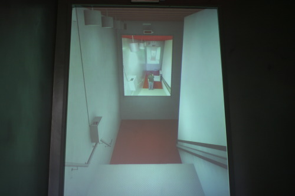
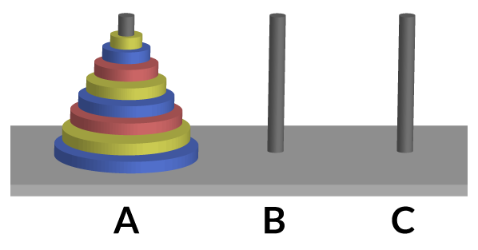

# Hash Tables(Continuación...)

La clase pasada terminamos de revisar un metodo simple para crear una funcion hash.

[Implementacion](./codigos/clase_09_practica_01.cpp)

Cuya complejidad es $O(n^2)$

Después vimos la misma función hash, implementada utilizando `std::sort` que redujo la complejidad a $O(n\cdot \log{n})$.

[Implementacion](./codigos/clase_09_practica_02.cpp)

Hoy y probablemente la siguiente clase continuaremos con su pratica de crear hashtables.

### Metodo 3 (Usando arreglos de pares)

Recordando, vamos a convertir un arreglo a su forma reducida.
Dado un arreglo con $n$ elementos distintos convertir el arreglo a una forma donde todos sus elementos se encuentren en el rango $0$ a $n-1$. El orden de los elementos debe mantenerse. Por ejemplo el $0$ sera colocado en el lugar del elemento más pequeño, 1 en el segundo más pequeño, ..., $n-1$ es colocado en el lugar del elemento más grande.

```
Input:  arr[] = {10, 40, 20}
Output: arr[] = {0, 2, 1}

Input:  arr[] = {5, 10, 40, 30, 20}
Output: arr[] = {0, 1, 4, 3, 2}
```
Ahora implementaremos un elemento muy util de la STL.
```
template<typename T1, typename T2> 
struct Pair{
    T1 first;
    T2 second;
};
```
- Implementar funcion `make_pair(key, value)`, que regresa un estructura de datos Pair.
- Implementar operador `=`
```
Pair<int, int> P1(10, 0)
Pair<int, int> P2 = P1
```
- Implementar operador `==` orden lexicografico.
- Implementar operador `!=`  orden lexicografico.
- Implementar operador `>=` orden lexicografico.
- Implementar operador `<=` orden lexicografico.
- Implementar operador `<<` impresion de un pair.
- Implementar metodo `swap`.


Ejemplo de sobrecarga de operadores:
`Pair& operator= (const Pair& pr);`

[Implementacion](./codigos/clase_10_ejemplo_00/main.cpp)

Siguiente clase continuamos con la practica, para ello será necesario que hagan el cambio siguiente en el código de la clase anterior:
```
void Convert(int arr[],int arr_convert[], int n){ 
	int temp[n]; 
	memcpy(temp, arr, n*sizeof(int)); 
	std::sort(temp, temp + n); 
	std::unordered_map<int, int> umap; 
	for (int i = 0; i < n; i++) {//i = 0
        umap[temp[i]] = i; //umap[temp[0]] = 0; umap[10] = 0; umap[0] = (10, 0)
    }
	for (int i = 0; i < n; i++) {
        arr_convert[i] = umap[arr[i]]; 
    }
} 
```
Ahora en lugar de usar un `unordered_map`  usaran un `Array` que ya implementaron previamente pero ahora de elementos `pair`, que nos servirá en lugar del `unordered_map`.

- Implementar Insercion
- Implementar Busqueda
- Implementar Borrado


---

# Recursión.

## ¿Qué es la recursión?

El proceso en el cual una función se llama asi misma ya sea de manera directa o manera indirecta se conoce como **recursion**, está función  es llamada **función recursiva**. Normalmente usamos recursión por que facilita la resoución de un sin número de problemas de manera sencilla en comparación a como sería de manera iterativa.

Ejemplo de problemas famosos que se resuelven con recursión:

- Inorden/preorden, postorden transversal de arboles.
- Computo del factorial de un número.
- Torres de Hanoi.


## Sintaxis Básica

```
La sintaxis es:
    has_algo(){
    <instrucción 1>
    <instrucción 2>
    .
    .
    .
    has_algo();
    .
    .
    .
    <instrucción n>
}
```
A primera vista puede parecer extra&ntilde;o y hasta rid&iacute;culo. Pero está
es una de las herramientas más poderosas en programación. Cada función recursiva puede ser treansformada a una iterativa y vicecersa. Aunque usar recursión puede provocar muchos errores

Un ejemplo más sencillo que nos ayudara a ver como funciona la recursión:

[codigo](codigos/clase_10_practica_01.cpp)

```
void printANumber(int n) 
{ 
    if (n < 1) {
        return;
    }else{ 
        //std::cout << n << " "; 
        printANumber(n-1);
        std::cout << n << " "; 
        return;
    } 
} 
  
int main() 
{ 
    int n = 20; 
    printANumber(test); 
}
```


## Recursión en el mundo real.
Un ejemplo, es cuando ponemos dos espejos que están uno frente al otro, el primero de ellos refleja lo que se ve en el segundo,pero el segundo espejo refleja lo que se ve en el primero. Si nos colocamos en medio de los dos espejos, podremos ver muchas
imágenes de nosotros cada una más pequeña y lejana que la otra.




## Factorial

Un ejemplo clásico de una función recursiva es la función usada para calcular el factorial de un entero.

Recordando la definifión de el factorial de un número $n$, denotado por $n!$

$$n! = n \cdot (n-1)!$$

aplicando la formula $n$ veces tenemos que:

$$n! = n\cdot (n-1) \cdot (n-2) \cdots 2 \cdot 1$$

Definición de la función:

$${\displaystyle \operatorname {fact} (n)=\left\{{\begin{array}{lccl}si&n=0&\longrightarrow &1\\si&n>0&\longrightarrow &n\cdot \operatorname {fact} (n-1)\\\end{array}}\right.}$$


```
int fact(int n){
    if (n <= 1){ // caso base
        return 1;
    }else{
        return n*fact(n-1);    
    }
}
```
Corriendo el [codigo](codigos/clase_10_practica_02.cpp) tenemos el siguiente resultado:
```
Factorial de 0 es 1
Factorial de 1 es 1
Factorial de 2 es 2
Factorial de 3 es 6
Factorial de 4 es 24
Factorial de 5 es 120
Factorial de 6 es 720
Factorial de 7 es 5040
Factorial de 8 es 40320
Factorial de 9 es 362880
```


## Torres de Hanoi

La “Torres de Hanói” es un juego matemático inventado en 1883 por el matemático francés Éduard Lucas. Basicamente, consiste en tres varas verticales puestas en una misma base. En la primera de ellas se ubican  discos de diferente tamaño y el objetivo consiste en trasladar los discos de la primera vara hacia la tercera vara.

A mayor cantidad de discos, mayor será la complejidad de la solución. Desde la base, los discos se apilan de mayor a menor. Para completar el juego, es necesario seguir tres simples reglas:

- Sólo se puede mover un disco cada vez.
- Un disco de mayor tamaño no puede descansar sobre uno más pequeño
- Sólo se puede desplazar el disco que se encuentre arriba en cada varilla.



- A es la torre origen
- B es una torre auxiliar 
- C torre destino

[Juego Online](https://www.geogebra.org/m/NqyWJVra)


Definición de la función:

$${\displaystyle \operatorname {hanoi} (n)=\left\{{\begin{array}{lccl}si&n=1&\longrightarrow &1\\si&n>1&\longrightarrow &2\cdot \operatorname {hanoi} (n-1)+1\end{array}}\right.}$$

Relación de recurrencia para hanoi:

$${\displaystyle h_{n}=2h_{n-1}+1}$$
$${\displaystyle h_{1}=1}$$

Ahora como practica de la clase implementen esta función recursiva.


Ejercicio de practica:
- Implementar la función de inserción en listas simplemente ligadas usando recursión.
