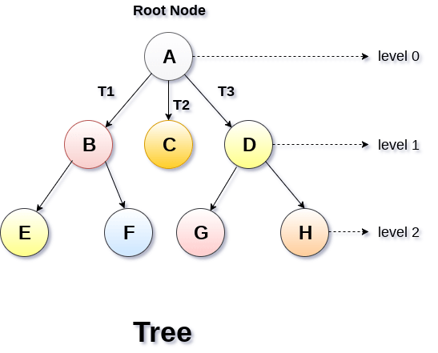
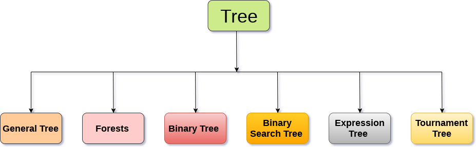
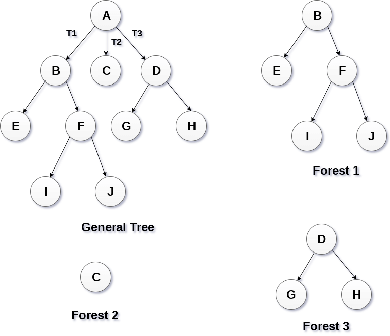
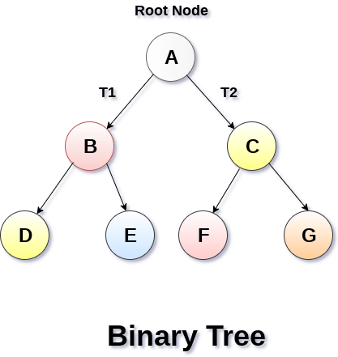
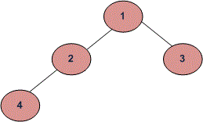
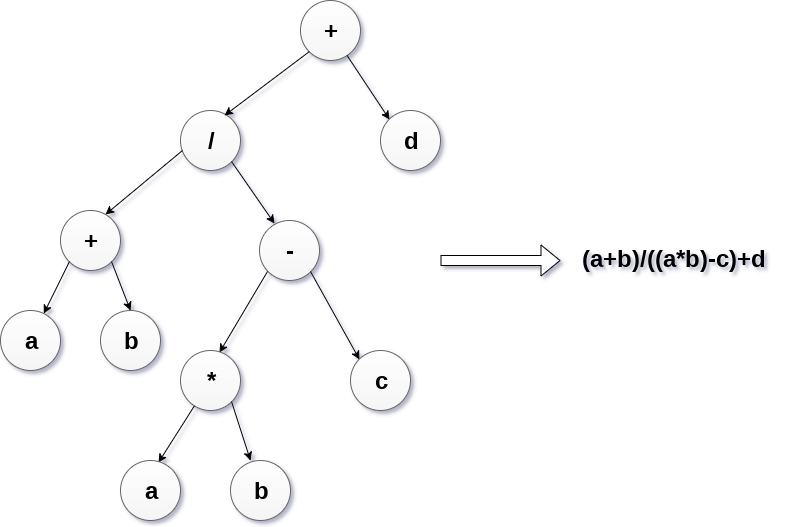
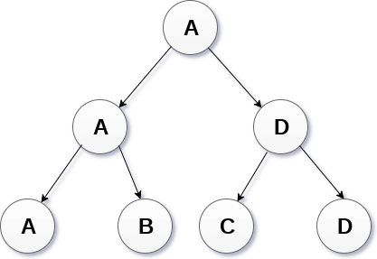

# Sesión 11

## Continuación de HashTables

Primero que nada hay que corregir un problema en el código de la clase pasada.

```
template <typename T1, typename T2>
Pair<T1, T2>& Pair<T1, T2>::operator= (const Pair<T1, T2>& pr){
    return Pair<T1,T2>(pr.first, pr.second);
}
```

Al sobrecargar un operador como `=`, tenemos que tenemo mucho cuidado con lo que regresamos, en este caso estamos regresando una nueva instancia, lo cual nos causara muchos errores, más adelante veremos algunos ejemplos.

La forma correcta de realizar dicha sobrecarga:
```
template <typename T1, typename T2>
Pair<T1, T2>& Pair<T1, T2>::operator= (const Pair<T1, T2> &pr){
    // Revisar auto asignamiento
    if (this == &pr){ // preguntamos si es el mismo objeto
        return *this; // si es asi, entonces regresamos *this referencia a la instancia original
    }
    (*this).first = pr.first;
    (*this).second = pr.second;
    return *this;
}
```


Ahora veamos como hacer el ejercicio dejado la clase pasada,

En la clase 9 usamos 

```
std::unordered_map<int, int> umap; 
```

para poder sustituir este `unordered_map` basta con crear
una relación entre números enteros y nuestra serie consicutiva de enteros, esto lo logramos definiendo un arreglo auxiliar:

```
int umap[100] = {0};
```

no es ideal pero nos sirve como ejemplo de la implementación  de una tabla hash basada en el orden de los números.

[codigo](/codigos/clase_09_practica_03.cpp)


Ahora para que servia nuestra clase `Pair`?

[codigo](/codigos/clase_11_ejemplo_00/main.cpp)


--- 

## Arboles (Estructura No-Lineal)

Un árbol es una estructura recursiva que contiene un conjuto de uno o más nodos, donde el primer nodo es llamado `raiz`(`root`) del árbol y el resto de los nodos simplemente son llamados hijos o hojas del arbol. Todos estos nodos hijos mantienen una relación padre-hijo. Cada nodo de un arbol puede tener cualquier numero de hijos pero solo un padre.



*Image from www.javatpoint.com*

## Terminología Básica
- Nodo `raiz`(`root`): El nodo raiz es el nodo que se encuentra en la parte superior del árbol, y el único nodo que no tiene padre.
- `Sub-Arbol`(`Subtree`): Si la raiz es no nula, en la imagen los arboles `T1`, `T2` y `T3` son llamados subarboles del nodo raiz.
- `Nodo Hoja`(`Leaf Node`): Un nodo que no tiene hijos es llamado un `nodo hoja`. Básicamente son los nodos que se encuentran en la parte inferior del árbol.
En el ejemplo serían `E`,`F`,`G`,`H`.
- `Trayectoria`(`Path`): Una secuencia de lados consecutivos es llamada `trayectoria`.
Por ejemplo:

$$A\longrightarrow B\longrightarrow E$$
$$A\longrightarrow B\longrightarrow F$$

- `Nodo Ancestro` (`Ancestor node`): Es cualquier nodo predecesor sobre la trayectoria de la raiz al nodo.

- `Grado`(`Degree`): El grado de un nodo es igual al numero de hijos que este nodo tiene.

- `Número de nivel` (`Level Number`):- Cada nodo del árbol tiene asignado un número de nivel de tal manera que cada nodo tiene un número mayor que el de su padre. El nodo raiz siempre esta en el nivel 0.


## Tipós de Arboles



*Image from www.javatpoint.com*

Los arboles tienen una gran variedad de clasificaciones que se definen en general por el grado de sus nodos.

- General Tree
- Forest
- Binary Tree
- Binary Search Tree
- Expresion Tree
- Tournament Tree

### General Tree (Arbol General)

Lo arboles generales se caracterizan por ser estructuras jerarquicas que cuentan con un nodo en el nivel 0 como elemento raiz. Los nodos que se encuentran en el mismo nivel se llaman hermanos.

### Forests
Los árboles `forest`(Bosque) son conjutos disjutos de árboles.



*Image from www.javatpoint.com*

## Binary Tree (Arbol Binario)

Un arbol binario es una estructura de datos en la cual cada nodo tiene a lo más dos nodos hijos(hojas). El nodo que se encuentra en la parte superior es llamado nodo raiz. Y un nodo sin nodos hijo es llamado hoja(`leaf`).

Estos son los arboles que veremos más a detalle durante el curso.

En uin árbol binario en el que cada elemento apunta a otros 2 elementos, comúnmente les llamaremos hijo izquierdo y hijo derecho (que podrían o no ser nulos).



La estructura básica para un nodo es la siguiente:
```
template <typename T>
struct Node {
    T data;
    Node *left;
    Node *right;
    Node(const T &val) {
        data = val;
        left = NULL;
        right = NULL;
    }
}
```



```
template<typename T>
struct Node{
    T data;
    Node *right;
    Node *left;
};
```

[implementacion 1](codigos/clase_11_practica_00.cpp)

Ejercicio, implementar versión inteligente de inserción por niveles, en cada nivel deberán estar en orden creciente el valor guardado en cada nodo, de arriba hacia abajo y de izquierda a derecha.

[implementacion 2](codigos/clase_11_practica_00.cpp)


## Binary Search Tree(Arbol binario de busqueda)

Un arbol binario de busqueda es simplemente un arbol binario ordenado. Todos los elementos en el subarbol izquierdo son menores que la raiz mientras que los elementos en el subarbol derecho son mayores o iguales que el nodo raiz.
Veremos muchos ejemplos de esta clase de arboles durante las siguientes clases.


Un árbol binario de buqueda normalmente es llamado arbol **ABB** en español o más conmunmente en ingles como **BST**, es un árbol binario en el cual para todo elemento, los elementos mayores a él, se ubican en su rama derecha, mientras que los elementos menores van en su rama izquierda. Cada elemento se almacena una sola vez por lo que no existen elementos repetidos(pueden llegar a existir pero entonces hay que definir un par de operaciones extras).


Cada elemento(nodo) de un árbol ABB cuenta con tres campos:
- Variable `data`, donde guardamos un dato que puede ser número, letra, string, ....
- Puntero al nodo derecho usualmente llamado `right` 
- Puntero al nodo izquierdo usualmente llamado `left`

Por ejemplo:

```
template<typename T>
struct Node{
    T data;
    Node *right;
    Node *left;
};
```

Al igual que cuando trabajamos con las listas ligadas, estos punteros son variables que guardarán en la memoria la dirección de otra variable en este caso la de una estructura llamado `Node`.

## Expression Tree

Los expression trees son utilizados para evaluar expresiones aritmeticas. Son arboles binarios donde cada nodo interno(no hoja) representa un operador, y cada una de las hojas representa un operando.

Expression trees are widely used to solve algebraic expressions like (a+b)*(a-b). Consider the following example.

Ejercicio. Construir un arbol para la siguiente operacion.

$$ \frac{a + b}{ a*b - c} + d $$



## Tournament Tree
Los Tournament tree a son usados para guardar el ganador de cada contienda en un torneo. Las hojas reprensentan los contricantes mientras que los internos representan los ganadores. En la raiz se encuentra el campeón.




## Recorridos de árboles

Los punteros son variables que guardaran en la memoria la dirección de otra variable en este caso la de una estructura llamado nodo.

- Inorden: Visitamos primero hijo izquierdo, luego el padre y finalmente el hijo derecho.
- Preorden: Visitamos el padre, luego el hijo izquierdo y finalmente el hijo derecho.
- Postorden: Visitamos al hijo izquierdo, luego el hijo derecho y finalmente el padre
