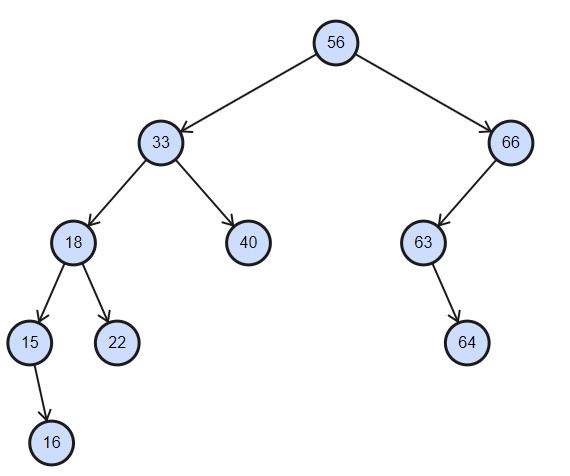

# Sesión 12
## Arboles Binarios
### Representación de Arboles Binarios

Hay dos tipos de representacion de arboles binarios:

- Representación con listas ligadas
- Representación secuencial


### Representación con listas ligadas

La que empezamos la clase pasada, guardamos los nodos de manera dinamica, en memoria no contigua, usando listas ligadas, donde la relación va de padres a hijos, cada nodo contiene 3 partes:
- Apuntador a nodo izquierdo
- Apuntador a nodo derecho
- Valor o dato a guardar en el nodo.


En memoria se veria algo parecido a la siguiente imagen:


### Representación secuencial
Es la representación más simple, que consiste en usar un arreglo estatico para guardar los nodos.


El tamaño del arreglo es basicamente el número de nodos en el arbol. La raiz del arbol es el nodo 0, y los hijos de cada nodo $i$ estan en las posiciones $2*i$ y $2*i+1$

### Para que queremos arboles?

A diferencia de los arreglos o las listas ligaras que son estructuras lineales, los arboles son estructuras de datos jerarquicas(no lineales), que podemos usar para guardar datos que naturalmente no son linerales, por ejemplo, la estructura de folders:


Más adelante veremos bastantes ejemplos de aplicación de arboles.


Primero que nada continuaremos con el ejercicio de la clase anterior, es decir, completaremos la función insert nodo
en un arbol binario.

```
template <typename T>
Node<T>* Insert(Node<T> *root, const T &val){
    if(nodeRoot == NULL){
        Node<T> *newNode = new Node<T>(val);
        return newNode;
    }
    // como ejercicio de la clase implementaran el resto de la función insert

}
```

Usualmente intentariamos crear un algoritmo que vaya llenando todas las ramas de un nivel. Como en la imagen que vemos a continuación:


Una función Insert en arboles binarios es la siguiente:
0. Si la raiz del arbol es NULA entonces insertamos el primer nodo en esta posición. En caso de que la raiz no sea nula, procedemos al siguiente paso.
1. Revisamos si el subárbol izquierdo es nulo, si lo es insertamos el nodo en esa posición, si no lo es, revisamos si el subárbol derecho es nulo, si lo es insertamos el nodo en esa posición. Si ambos son nulos vamos al nodo izquierdo.
2. Repetir sucesivamente el paso 1 hasta que se cumpla alguna de las siguientes a condiciones:
    - El subárbol derecho, o el subárbol izquierdo, es igual a nulo, en cuyo caso se inserta el elemento en el lugar que le corresponde a este nodo.

[implementacion](codigos/clase_12_practica_00.cpp)

Otra función Insert en arboles binarios es la siguiente:
0. Si la raiz del arbol es NULA entonces insertamos el primer nodo en esta posición. En caso de que la raiz no sea nula, procedemos al siguiente paso.
1. Comparamos el valor a insertar con la raíz del árbol. Si es mayor, se intenta insertar en el subárbol derecho. Si es menor, se intenta insertar en el subárbol izquierdo.
2. Repetir sucesivamente el paso 1 hasta que se cumpla alguna de las siguientes a condiciones:
    - El subárbol derecho, o el subárbol izquierdo, es igual a nulo, en cuyo caso se inserta el elemento en el lugar que le corresponde a este nodo.

Ejemplo:
56, 33, 18, 40, 15, 22, 16, 66, 63, 64



Al insertar el elemento 67 tenemos:


[implementacion](codigos/clase_12_practica_01.cpp)

```
 Arreglo: {5, 3, 8, 4, 2, 1, 7 , 6, 9, 10}
```


Una herramienta que nos ayuda a visualizar como funciona esta implementación esta en la siguiente pagina.

[herramienta 1](http://btv.melezinek.cz/)

[herramienta 2](https://www.cs.usfca.edu/~galles/visualization/BST.html)

## Recorridos en Arboles Binarios

Ahora en el resto de la clase como ejercicio implementaremos 3 de las formas de recorridos más comunes de arboles, conocidas en ingles como 
Depth First Traversals(DFT):


- (a) Inorder (Left, Root, Right) : 4 2 5 1 3
- (b) Preorder (Root, Left, Right) : 1 2 4 5 3
- (c) Postorder (Left, Right, Root) : 4 5 2 3 1

- Pre-orden:
    - Visitar la raíz.
    - Recorrer el subárbol izquierdo en pre-orden.
    - Recorrer el subárbol derecho en pre-orden.

- In-orden
    - Recorrer el subárbol izquierdo en entre-orden.
    - Visitar la raíz.
    - Recorrer el subárbol derecho en entre-orden.

- Post-orden
    - Recorrer el subárbol izquierdo en post-orden.
    - Recorrer el subárbol derecho en post-orden.
    - Visitar la raíz.


Otra manera clásica de recorrer arboles es:
Breadth First Traversal(BFT) o Level Order Traversal(LOT) : 1 2 3 4 5