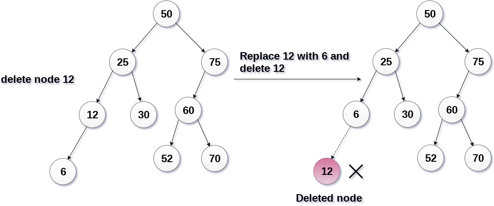

# Sesión 13
## Arbol de Busqueda Binaria

Un arbol de busqueda binaria(ABB o BST), es un arbol en el que la inserción de los nodos se realiza de manera especial. Este tipo de arboles tambien es llamado arbol binario ordenado. La principal caracteristica de los arboles BST, es que todos los nodos del subarbol izquierdo son menores el nodo raiz, y todos los nodos del subarbol derecho son mayores o iguales que el nodo raiz. Esto se aplica de manerea recursiva para cada subarbol del arbol original y tenemos:


## Ventajas de utilizar arboles de busqueda binaria

- Las busquedas de elementos en un arbol de busqueda binaria son muy eficientes.
- Los arboles de busqueda binaria se consideran eficientes en comparación con los arreglos y las listas ligadas. Al momento de realizar una busqueda eliminamos medio arbol en cada iteracion por lo cual una busqueda tiene complejidad $O(\log_{2}{n})$. Y en el peor de los casos tiene complejidad $O(n)$.
- Esto tambien incremenda la eficacia de las operaciones inserción  y borrado en comparación con arreglos o listas ligadas.

La clase pasada vimos como crear un arbol de busqueda binaria como el siguiente:
```
{43, 10, 79, 90, 12, 54, 11, 9, 50}
```
```
template <typename T>
Node<T>* Insert(Node<T>* root, T data) {
    if(root == NULL) {
        return new Node<T>(data);
    } else {
        Node<T> *newNode;
        if(data <= root->data) {
            newNode = Insert(root->left, data);
            root->left = newNode;
        } else {
            newNode = Insert(root->right, data);
            root->right = newNode;
        }
        return root;
    }
}
```


Hoy continuaremos con la implementación de otros 2 metodos:

- Busqueda de elementos dentro del arbol identificando el nodo en el que se encuentra.
- Borrado de un nodo específico, de tal manera que siga siendo un arbol de busqueda binaria.


## Busqueda en arboles binarios

1. Comparamos el elemento con el valor del nodo raiz.
2. Si el valor del nodo corresponde con el valor del elemento, regresamos el apuntador de memoria al nodo. 
    - En otro caso si el valor del elemento es menor que el del nodo, entonces repetimos el paso **1** en el subarbol izquiedo. Si no,
    -  entonces repetimos el paso **1** en el subarbol derecho.
3. Repetimos el algortimo recursivamente hasta encontrar el valor, si no lo encontramos regresamos `NULL`.


[implementacion](codigos/clase_13_practica_00.cpp)


## Borrado de nodos en arboles de busqueda binaria

Tenemos tres casos que debemos analizar al momento de borrar un nodo de un arbol de busqueda binaria, de tal manera que el arbol resultante siga siendo un arbol de busqueda binaria.

### Borrar un nodo que es de hecho una hoja del arbol.

Para hacer esto basta con hacer null este nodo(el apuntador a este nodo se hace nulo, y se libera la memoria de dicho nodo).


### Borrado de un nodo con un solo nodo hijo

- En este caso remplazamos el valor del nodo con el valor de su nodo hijo y borramos el nodo hijo.
- Le decimos a el padre del nodo que queremos borrar(en este caso el padre del nodo 12 es el nodo 25), que su hijo ya no es el nodo original, ahora es el hijo de su hijo(esto es, el hijo izquierdo de 25 sera ahora el nodo con valor 6 y libreramos la memoria del nodo 12)




### Borrado de un nodo con dos nodos hijos

El nodo que será borrado es remplazado con su inorden sucesor o predecesor de manera recursiva, hasta que el nodo se convierte en un nodo hijo donde dicho nodo es remplazado con un apuntador nulo(`NULL`) y se libera la memoria de dicho nodo.

En el ejemplo, el nodo 50 será borrado. Su recorrido inorden es:

`6, 25, 30, 50, 52, 60, 70, 75.`

remplazamos 50 con su sucedor en este recorrido inorden(52).
Ahora 50 es una hoja del arbol que sabemos como borrar.


