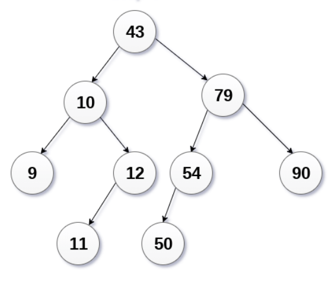
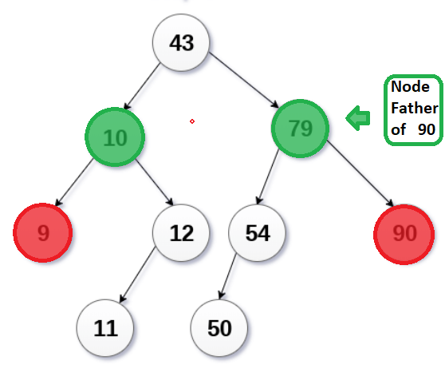
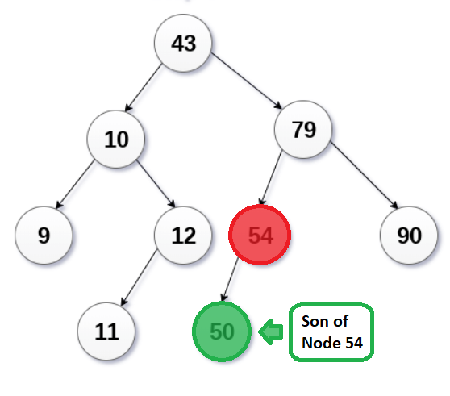
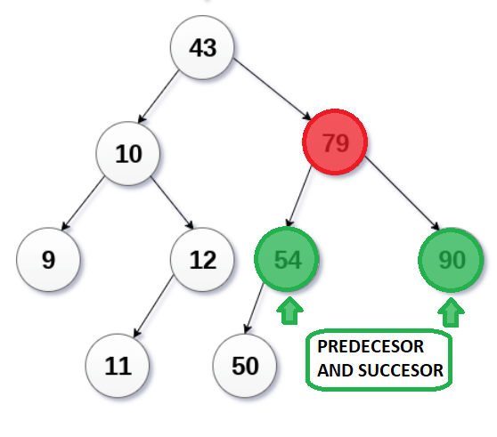
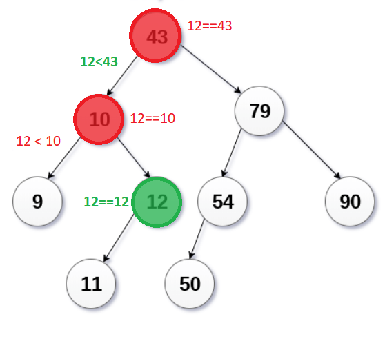

# Sesión 14 
## Arbol de Busqueda Binaria (Continuación)


## Borrado de nodos en arboles de busqueda binaria

Tenemos tres casos que debemos analizar al momento de borrar un nodo de un arbol de busqueda binaria, de tal manera que el arbol resultante siga siendo un arbol de busqueda binaria.

### Borrar un nodo que es de hecho una hoja del arbol.

Para hacer esto basta con hacer null este nodo(el apuntador a este nodo se hace nulo, y se libera la memoria de dicho nodo).
Consideremos el arbol generado al insertar
`{43, 10, 79, 90, 12, 54, 11, 9, 50}`



Ahorra borraremos los nodos `90` y `9` que son nodos hojas.

Para ello creamos una nueva funcion `Search` que nos dira en que nodo esta el valor que buscamos y quien es su nodo padre.

```
template <typename T>
Node<T> *Search(Node<T> *root, const T &val, Node<T> * &parentNode) {
    Node<T> *currentNode = root;
    Node<T> *tempNode = NULL;
    while(currentNode != NULL && currentNode->data != val){
        tempNode = currentNode;
        if(currentNode->data > val){
            currentNode = currentNode->left;
        }else{
            currentNode = currentNode->right;
        }
    }
    if(currentNode != NULL){
        parentNode = tempNode;
        return currentNode;
    }else{
        return NULL;
    }
}
``` 


[implementacion caso 1](codigos/clase_13_practica_02.cpp)


### Borrado de un nodo con un solo nodo hijo

- En este caso remplazamos el valor del nodo con el valor de su nodo hijo, y reasignamos apuntadores para que el nodo izquierdo del padre apunte al nodo izquierdo del hijo y el nodo derecho del padre apunte al nodo derecho del hijo, entonces estamos listos para borrar el nodo hijo.




[Implementacion](codigos/clase_14_practica_01.cpp)


### Borrado de un nodo con dos nodos hijos

El nodo que será borrado es remplazado con su inorden sucesor o predecesor de manera recursiva, hasta que el nodo se convierte en un nodo hoja donde dicho nodo es remplazado con un apuntador nulo(`NULL`) y se libera la memoria de dicho nodo.

En el ejemplo, el nodo 79 será borrado. Su recorrido inorden es:

`9 10 11 12 43 50 54 79 90`

remplazamos 79 con su sucedor en este recorrido inorden(90).
Ahora 50 es una hoja del arbol que sabemos como borrar.



El problema más grande en la descripción que acabamos de ver es ¿como encontrar el predecesor o sucesor de un nodo en un arbol?

Supongamos que buscaremos el predecesor, entonces:
#### Opción 1 (dejaré esta implementación como tarea)

- Imprimimos la lista en inorden y la guardamos en un arreglo, una vez en un arreglo es sencillo determinar quien es el predecesor del nodo a borrar, podemos asegurar que existe ya que el nodo que queremos borrar tiene dos hijos, asi que es seguro que existe un valor menor que el que se encuentra en el nodo.
- Una vez que tenemos el valor del predecesor(o sucesor) con la función `Search`, borramos el nodo predecesor y asignamos el valor del predecesor al nodo actual.

#### Opción 2
- Buscamos el nodo más grande del subarbol izquierdo, con esto encontramos al predecesor(analogamente el más pequeño del subarbol derecho nos da el sucesor).
- Una vez que tenemos el valor del predecesor(o sucesor), borramos el nodo predecesor(o sucesor) y asignamos el valor del predecesor(o sucesor) al nodo actual.

[Implementacion](codigos/clase_14_practica_02.cpp)

## Ejercicios

- Implementar versión recursiva de funcion `Search `

`Node<T> *Search(Node<T> *root, const T &val, Node<T> * &parentNode)`

Busquemos a 12 en el arbol.



```
template <typename T>
Node<T> *Search2(Node<T> *currentNode, const T &val, Node<T> * &parentNode) {
    if(currentNode == NULL){
        parentNode = NULL;
        return NULL;
    }
    if(currentNode->data == val){
        return currentNode;
    }
    parentNode = currentNode;
    if(currentNode->data > val){
        return Search2(currentNode->left, val, parentNode);
    }else{
        return Search2(currentNode->righ, val, parentNode);
    }
}
```

[Implementacion](codigos/clase_14_practica_03.cpp)

- Implementar versión recursiva de funcion `Delete `

`Node<T> *Delete(Node<T> *root, const T &val)`

[Implementacion](codigos/clase_14_practica_04.cpp)
