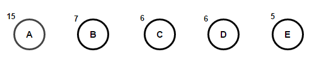
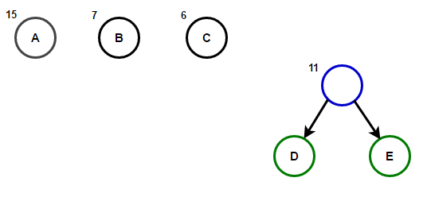
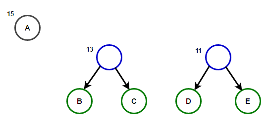
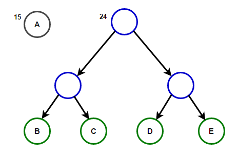
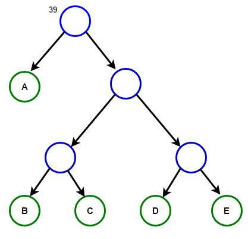
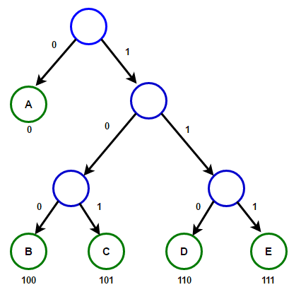

# Sesión 15

## Codificación de Huffman

Codificación de Huffman(o Huffman Encoding) es un algoritmo para hacer compresión de información y es la versión más sencilla de lo que hoy conocemos como compresión de archivos.

Nosotros sabemos que cada caracter es guardado como una secuencia de 0's y 1's usando 8 bits. Esto es llamado `fixed-length encoding`, ya que cada caracter usa la misma cantidad de bits para ser guardado.

Basicamente podemos representar cualquier numero en el rango 0-255 con 8 bits.
|Binario|Decimal|
|---|---|
|00000000| = 0|
|00000001| = 1|
|00000010| = 2|
|...||
|11111111| = 255|

### Ahora Huffman en los 50's se pregunto, dado un texto ¿como podemos reducir la cantidad de espacio necesario para guardar un caracter?

La idea básica que formulo Huffman fue usar `variable-length encoding`. Podemos explotar el hecho de que en un texto algunos caracteres aparecen más veces que otros caracteres([frecuencia de uso de letras en español](https://es.wikipedia.org/wiki/Frecuencia_de_aparici%C3%B3n_de_letras)
) para diseñar un algoritmo que pueda representar la misma pieza de texto usando un menor número de bits.

En `variable-length encoding`, asignamos un número de bits a caracteres dependiendo del número de veces que aparece en el texto. Asi que algunos caracteres podrían terminar usando 1 bit, otros 2 y asi sucesivamente. El problema con está técnica no es como **codificar** sino como **decodificar**.

### La nueva pregunta es dada una secuencia de bits ¿como podemos decodificarla de manera única?

Consideremos la cadena de caracteres `aabacdab`. Tiene 8 caracteres y se usan 64 bits para poder guardarla usando `fixed-length encoding`. Si hacemos un mapa de frecuencias tenemos que:

| Caracter | Frecuencia |
|---|---|
|'a'|4|
|'b'|2|
|'c'|1|
|'d'|1|
 
Ahora usemos estas frecuencias para crear una codificación que utilice menos bits.

| Caracter | Frecuencia |bits|
|---|---|---|
|'a'|4|0|
|'b'|2|11|
|'c'|1|100|
|'d'|1|011|

Asi que la cadena de caracteres `aabacdab` sera codificada como `00110100011011 (0|0|11|0|100|011|0|11)`. Ahora usando la misma tabla tenemos las siguientes posibles decodificaciones:

- 0|011|0|100|011|0|11    adacdab
- 0|0|11|0|100|0|11|011   aabacabd
- 0|011|0|100|0|11|0|11   adacabab
- ...

Para prevenir ambiguedades en el decodificado, nos aseguraremos que nuestra manera de codificaer satisfaga `uniquely decodable codes`, es decir, que se decodifique de manera única.
La regla de prefijo dice que ningun codigo es prefijo de algun otro.En el ejemplo de arriba 0 es prejijo 011, lo que viola dicha regla. Un codigo que satisfaga dicha regla será decodificable de manera única.

Cambiemos la asignación a:

| Caracter | Frecuencia |bits|
|---|---|---|
|'a'|4|0|
|'b'|2|10|
|'c'|1|110|
|'d'|1|111|

Con esto la codificación y decodificación es:

`|a|a|b|a|c|d|a|b|` <-> `|0|0|10|0|110|111|0|10|`.

La codificación de Huffman trabaja creando un arbol binario de nodos. Un nodo puede ser una hoja interna o externa.

Inicialmente todos los nodos son nodos hojas, que solo contienen caracteres y el peso de los caracteres, que en este caso sera la frecuencia de dicho caracter.

Los nodos internos contienen los pesos de los caracteres y ligan dos nodos hijos.

Por convención el bit `0` representa el nodo izquierdo y el  bit `1` representa el nodo derecho. Un arbol completo tiene `n` hojas y `n-1` nodos internos.

Usaremos un priority queue(cola de prioridad) para construir nuestro arbol Huffman, donde cada nodo con la frecuencia más baja se le da la más alta prioridad.

Para hacerlo realizamos los siguientes pasos:

1. Creamos un nodo hoja por cada caracter y los agregamos a un priority queue.

2. Mientras halla más de un nodo en el queue:
    - Removemos los dos nodos con la mayor prioridad(los que aparecen menos veces en el texto) del priority queue.
    - Creamos un nuevo nodo interno con esos dos nodos como nodos hijos y con frecuencia igual a la suma de las dos correspondientes frecuencias.
    - Agregamos el nuevo nodo al priority queue.

3. El nodo que sobrevive al final se vuelve el nodo raiz y por fin el arbol está terminado.

Como ejemplo consideremos un texto que solo contiene los siguientes caracteres `{'A','B','C','D','E'}` y sus respectivas frecuencias son: `{15, 7, 6, 6, 5}` respectivamente.

1. Creamos los nodos hoja:

2. Tomamos dos de los nodos con menores frecuencias y creamos un nodo con la suma de sus frecuencias:

3. Repetimos el proceso ahora son los nodos con 7 y 6:

4. Repetimos el proceso ahora son los nodos con 13 y 11:

5. Repetimos el proceso ahora son los nodos con 15 y 24 y por fin nos queda un solo nodo con 39:

La trayectoria desde la raiz a cualquier hoja genera un prefijo de codificación optimo(el famoso código Huffman).

[Implementación](codigos/clase_15_practica_01.cpp)