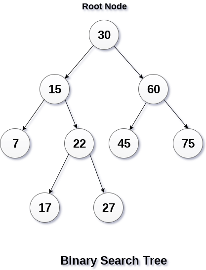
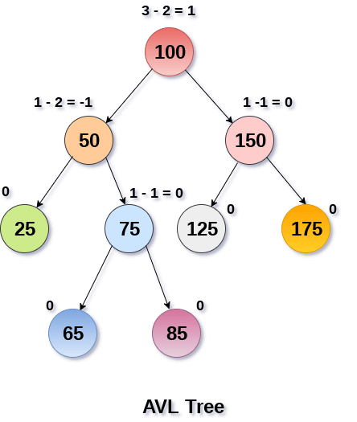

# Primero revisemos las respuestas del exámen

1. La complejidad de cuatro algoritmos son `O(2^n)`, `O(logn)`, `O(n^3)` y `O(n)` respectivamente. Cuando `n` es muy grande, ¿cuál de los cuatro algoritmos es el más eficiente?

- a) `O(2n)`
- **b) `O(logn)`**
- c) `O(n^3)`
- d) `O(n)`

2. Crear una función que sume los elementos de una lista simplemente ligada de enteros recursivamente.
```
template <typename T>
T suma(Node<T>*root){
    if(root!=NULL){
        return root->data + suma(root->next);
    }
    return T(0);
}

return root->data+root->next->data+... + root->next->...->next->data
```

3. Crear una función que sume los elementos de una lista simplemente ligada de enteros de manera iterativa.
```
template <typename T>
T suma(Node<T>*root){
    Node<T> *temp = root;
    T resultado = T(0);
    while(temp != NULL){
        resultado += temp->data;
        temp = temp->next;
    }
    return resultado;
}
```

4. ¿Qué imprime el siguiente código?
```
int cuenta(int numero){
    numero -= 1
    if(numero > 0){
        std::cout << numero <<" ";
        cuenta(numero)
    }
    return 0;
}

int main(){
    cuenta(10);
    return 0;
}

R.- 9 8 ..... 1
```  

5. En el siguiente árbol binario de búsqueda ¿Cuál es el resultado de su recorrido inorden?



`R.- 7, 15, 17, 22, 27, 30, 45, 60, 75`


6. En el siguiente árbol de busqueda binaria, al borrar el nodo 22 ¿por qué otro nodo podrá ser reemplazado para que el árbol resultante siga siendo un árbol de busqueda binaria?


- a) 30
- b) 15
- c) 60
- **d) 17**

7. En el siguiente árbol de busqueda binaria se quiere buscar el elemento 22, ¿cuántas llamadas se realizarán a la función buscar?


- a) 0
- b) 1
- c) 2
- **d) 3**

8. Si se construye un arbol de busqueda binaria con los siguientes valores `{11, 6, 8, 19, 4, 13, 5, 17, 43, 49, 16, 31, 32}`, ¿Cual es el hijo izquierdo de nodo con el valor 43?

- a) 31
- b) 49
- c) 19
- d) 13

```
     11
    /  \
   6     19
  /  \    /  \
 4    8  13     43
  \        \     / \
   5        17  31  49
           /
          16
         

R.- 31
```

9. En el peor caso, cual es la complejidad del recorrido en postorden de un arbol de busqueda binaria con `n` nodos:

- a)   `O(log n)`
- **b)   `O(n)`**
- c)   `O(n * log n)`
- d)   `O(n^2)`

```
O(n) ~ O(n+cualquiernumero)
O(n) ~ O(2*n) ~ O(3*n)
```

10. En un arbol de busqueda binaria, el elemento más grande debe cumplir:

- a)   ser un nodo raiz.
- b)   ser un nodo hoja.
- c)   debe tener al menos un hijo.
- **d)   tiene a lo más un hijo.**


# Arboles de Busqueda Binaria

## Problemas básiscos de arboles binarios

### Dado un preorden transversal reconstruir el arbol de busqueda binaria.


Supongamos que tenemos el siguiente preorden `{10, 5, 1, 7, 40, 50}`, entonces la salida deberia ser el siguiente arbol:

```
       10
      /  \
    5     40
   / \     \
  1   7     50
```

### Metodo 1 ( Complejidad `O(n^2)`)

1. El primer elemento de un recorrido tranversal en preorden siempre es la raiz. Asi que construimos la raiz, 
2. después buscamos el primer elemento más grande que la raiz. En este caso particular es el de indice `i=4`, esto quiere decir que todos los elementos entre la raiz y este indice `i` son parte del subarbol izquierdo(`{5,1,7}`) y todos los elementos entre `i+1` y `n-1` serán parte del subarbol derecho(`{40,50}`).
```
             10
           /    \
          /      \
  {5, 1, 7}       {40, 50}
```
3. Ahora podemos repetir paso 1 y 2 tanto al subarbol izquierdo como al subarbol derecho.

[implementacion](codigos/clase_18_practica_01.cpp)


### Metodo 2 ( Complejidad `O(n)`)

La siguiente implementación que me encontre en geek4geeks es muy buena!!!

En esta opcion creamos el conjunto `{min max}` para cada nodo.
Inicializamos el rango con `{INT_MIN .. INT_MAX}`. El primer nodo. esta obviamente dentro del rango, con esto creamos el nodo raiz, para construir el subarbol izquierdo  creamos el rango 
`{INT_MIN .. root->data}`, si un valor esta en el rango `{INT_MIN .. root->data}` significa que pertenence al subarbol izquierdo. Para construir el arbol derecho hacemos lo mismo pero ahora con el rango `{root->data .. INT_MAX}`.

Esta clase de técnica se acostumbra llamar con pivote.

[implementacion](codigos/clase_18_practica_02.cpp)

# Arboles AVL(Arboles Balanceados)

Si `n=3000` en un arbol bien balanceado tendriamos que realizar $log_{2}n$ operaciones. Esto es,

$$log_{2}(3000) = \frac{log_{10}3000}{log_{10}{2}} \approx \frac{3.47}{.30} \approx 12$$

Si usaramos un algoritmo de busqueda arbitraria como quick sort(`O(nlogn)`) en un arreglo, esto es,

$$  \approx 3000*3.47 \approx 9000$$

Los arboles AVL en honor a GM Adelson-Velsky-EM Landis, son arboles de busqueda binaria balanceados por altura, en los cuales a cada nodo se le asocia un factor de balance, el cual se calcula substrayendo la altura de su subarbol derecho menos la altura de su subarbol izquierdo.

Un arbol de busqueda binaria se dice balanceado si el factor de balance de cada nodo esta entre -1 y 1. En cualquier otro caso se dice que es un arbol desbalanceado.

Si el factor de balance de un nodo es 1, quiere decir que su subarbol izquierdo termina un nivel arriba de donde termina su subarbol derecho.

Si el factor de balance de un nodo es 0, quiere decir que su subarbol izquierdo termina en el mismo nivel que termina su subarbol derecho.

Si el factor de balance de un nodo es -1, quiere decir que su subarbol derecho termina un nivel arriba de donde termina su subarbol izquierdo.

Ejemplo: 


 

Como buscar elementos y hacer recorridos no modifica arboles binarios entonces estas operaciones son perfectamente validas en arboles AVL.


Como practica quiero que intenten hacer una función de inserción y otra de borrado, que mantenga la condición de serguir siendo un arbol AVL.

### Ejercicio para siguiente clase o antes
- Implementar función que calcule el factor de balanceo y lo guarde en cada nodo en una variable llamada factor.
