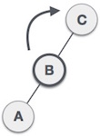

# Arboles AVL(Arboles Balanceados)

Los arboles AVL en honor a Adelson-Velsky-Landis, son arboles de busqueda binaria balanceados por altura, en los cuales a cada nodo se le asocia un factor de balance, el cual se calcula substrayendo la altura de su subarbol derecho menos la altura de su subarbol izquierdo. Este arbol no necesariamente es el más optimo pero fue uno de los primeros algoritmos para crear  arboles autobalanceables (Esto fue en 1962, es decir, es super viejo este algoritmo!!!!!).

Para conseguir esta propiedad de balanceo tanto la inserción como el borrado de los nodos se debe realizar de una forma especial.

`{100, 50, 25, 75, 65, 85, 150, 125, 175}`


## Ejercicio de la clase anterior

Implementar función que calcule el factor de balanceo y lo guarde en cada nodo en una variable llamada factor.

[codigo](codigos/clase_20_practica_01.cpp) 

## Complejidad
|Algoritmo|	Caso Promedio|	Peor de los casos|
|---|---|---|
|Espacio(memoria)|	o(n)|	o(n)|
|Busqueda|	o(log n)|	o(log n)|
|Inserción|	o(log n)|	o(log n)|
|Borrado|	o(log n)|	o(log n)|

## Inserción

La inserción en arboles AVL es realizada de la misma manera que en los arboles de busqueda binaria, el rpoblema es que puede violar la propiedad de ser arbol AVL, y es en estos casos donde será realizado un balanceo del arbol. El arbol puede ser balanceado aplicando lo que se conoce como `rotaciones`, estas rotaciones serán necesarios solo cuando al insertar un nodo se modifique el valor de factor de balanceo del nodo.

Dependiendo del tipo de inserción, las rotaciones son clasificadas en 4 categorias:

|SN|	Rotación|	Descripción|
|---|---|---|
|1|	LL| El nuevo nodo es insertado en el subarbol izquierdo del subarbol izquierdo de un nodo critico.|
|2|	RR| El nuevo nodo es insertado en el subarbol derecho del subarbol derecho de un nodo critico.|
|3|	LR| El nuevo nodo es insertado en el subarbol izquierdo del subarbol derecho de un nodo critico.|
|4|	RL| El nuevo nodo es insertado en el subarbol derecho del subarbol izquierdo de un nodo critico.|

## Rotaciones

Dadas tres letras `A,B,C` con valores `1,2,3` respectivamente tenemos basicamente 6 posibles permutaciones, pensandolos como los posibles arboles, tenemos:

- A,B,C (no balanceado RR)
- A,C,B (no balanceado LR)
- B,A,C (balanceado)
- B,C,A (balanceado)
- C,A,B (no balanceado RL)
- C,B,A (no balanceado LL)

Por lo tanto dados 3 valores de un arbol tenemos 4 posibilidades que generan arboles no balanceados y tenemos que ver como resolverlos.
Para ellos tenemos dos operaciones básicas:
```
/* Estructura basica de Rotacion Derecha y Rotacion Izquierda
T1, T2 y T3 son subarboles del arbol con raiz "y" en el arbol a la izquieda
"x" en el arbol de la dereacho respectivamente
     y                               x
    / \     Rotacion Derecha        /  \
   x   T3   - - - - - - - >        T1   y 
  / \       < - - - - - - -            / \
 T1  T2     Rotacion Izquierda        T2  T3
Los valores data en cada nodo cumplen lo siguiente
 data(T1) < data(x) < data(T2) < data(y) < data(T3)
*/
```

### Rotación Derecha (`LL`)

Si al insertar nodo `A` se vuelve unbalanceado, hacemos una rotación derecha usando como pivote al nodo->B. El nombre viene justamente de la apariencia, como pueden ver es similar a rotar una posición hacia la derecha todos los elementos usando como eje de rotación al nodo->B.


#### Ejemplo

Insertamos el nodo->12 en el sigfuiente arbol balanceado


Al intentar insertar nodo->12 el nodo->100 se vuelve un nodo critico su factor se vuelve 2, entonces procedemos a rotar los nodos `{100,50,25}` usando como pivote al nodo->50.


Como 50 tiene un nodo derecho `nodo->75`, se vuelve el nodo izquierdo de nodo->100.

Ahora implementemos dicha operación:

[codigo](codigos/clase_20_practica_02.cpp)

### Rotación Izquierda (`RR`)

Si al insertar nodo `C` se vuelve unbalanceado, ahcemos una rotación izquierda. El nombre viene justamente de la apaariencia, como pueden ver es similar a rotar una posición hacia la izquierda todos los elementos.


#### Ejemplo

Insertar Nodo->100 en el siguiente arbol.


###  Rotación Izquierda Derecha LR

Está es una doble rotación, vamos a hacerla paso por paso. Como se pueden imaginar se trata de una rotación izquierda seguida de una rotación derecha.

 Detectamos que se encuentra no balanceado y de que caso se trata.

 Realizamos una rotación hacia la izquierda.

 Resultado de la rotación a la izquierda.

 Realizamos una rotación a la derecha.

 Finalmente arbol balanceado.

###  Rotación Derecha Izquierda RL

Está es una doble rotación, vamos a hacerla paso por paso. Como se pueden imaginar se trata de una rotación derecha seguida de una rotación izquierda.

 Detectamos que se encuentra no balanceado y de que caso se trata.

 Realizamos una rotación hacia la izquierda.

 Resultado de la rotación a la izquierda.

 Realizamos una rotación a la derecha.

 Finalmente arbol balanceado.


## Ejemplo

`63, 9, 19, 27, 18, 108, 99, 81`

Primero insertamos todos los elementos como en cualquier arbol de busqueda binaria.

- Paso 1.- Al insertar el nodo->63 su factor de balanceo es 0.
- Paso 2.- Al insertar el nodo->9 cambia el factor de balanceo a 1, nada que hacer por el momento.
- Paso 3,4.- Al insertar el nodo->19 cambia el factor de nodo->63 a 2, `se vuelve un nodo critico`, tenemos que hacer un cambio y esto es hacer una rotación LR, esto es, nodo->19 se convierte en padre de nodo->9, después realizamos un giro de todos los elementos a la derecha, esto es, nodo->19 se vuelve padre de nodo->9 y nodo->63.


- Paso 5,6,7,8.- Insertamos nodo->27, nodo->18, nodo->108, nodo->99

- Paso 9.- Insertamos nodo->81 lo cual crea un nodo critico, nodo->108.

- Paso 10.- Tenemos que hacer un cambio y esto es hacer una rotación LL, esto es, nodo->81 se convierte en padre de nodo->99, después realizamos un giro de todos los elementos a la derecha, esto es, nodo->88 se vuelve padre de nodo->81 y nodo->108.


[Visualizacion](https://www.cs.usfca.edu/~galles/visualization/AVLtree.html)


[codigo RR](codigos/clase_20_practica_03.cpp)

[codigo LR](codigos/clase_20_practica_04.cpp)