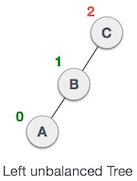
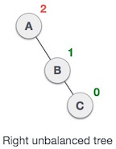
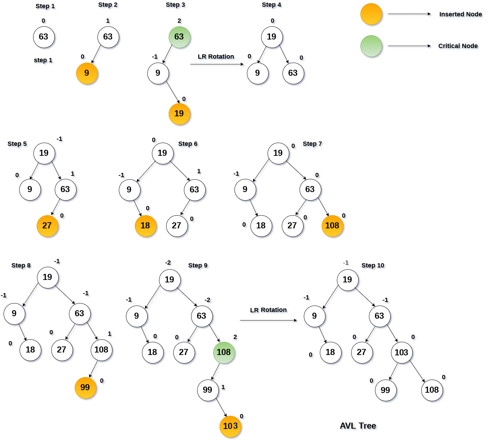
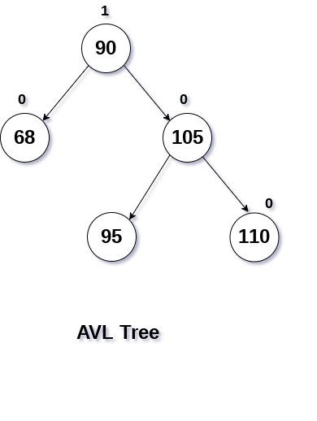
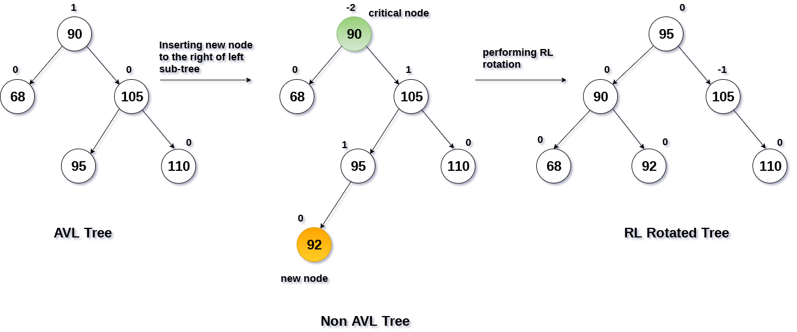

# Arboles AVL (Continuación)

|SN|	Rotación|	Descripción|
|---|---|---|
|1|	LL| El nuevo nodo es insertado en el subarbol izquierdo del subarbol izquierdo de un nodo critico.|
|2|	RR| El nuevo nodo es insertado en el subarbol derecho del subarbol derecho de un nodo critico.|
|3|	LR| El nuevo nodo es insertado en el subarbol derecho del subarbol izquierdo de un nodo critico.|
|4|	RL| El nuevo nodo es insertado en el subarbol izquiedo del subarbol derecho de un nodo critico.|


La clase pasada ya vimos como hacer un balanceo cuando tenemos la condición `LL` o `RR`.





Hoy terminaremos con los casos `LR` y `RL`.


### Rotación Izquierda Derecha (`LR`)

 
 
 
 

Vamos a crear el codigo y analizarlo paso por paso para que quede más claro el proceso:
```
T1, T2 y T3 son subarboles del arbol con raiz "C" en el arbol a la izquieda
     C                 C                   B
    / \     Paso L   /  \    Paso R      /   \
   A   T4   - - ->  B    T4  - - ->     A     C
  / \              / \                /  \   /  \
 T1  B            A   T3             T1  T2 T3  T4       
    / \          / \
   T2  T3       T1  T2
```

#### Rotacion Izquierda para caso LR

Tenemos dos posibles aproximaciones clásicas para la implementación de `LeftRotate`, una es mandar el nodo A como referencia, regresar y actualizar el valor de A, o pasar el valor de C y actualizar el valor del hijo de nodo izquierdo de C.
```
template <typename T>
Node<T>* LeftRotate(Node<T>* A){
    Node<T> *B  = A->right;
    Node<T> *T2 = B->left;
    Node<T> *T3 = B->right;
    B->left = A;   // su hijo izquierdo ya no es T2 ahora es A
    A->right = T2; // su hijo derecho ya no es B ahora es T2
    return B;  
}
// A = LeftRotate(A) cuidado con esto!!!  ó 
// C->left = LeftRotate(A) ó 
// C->left = LeftRotate(C->left)
```

```
     C                 C
    / \     Paso L   /  \
   A   T4   - - ->  B    T4
  / \              / \
 T1  B            A   T3
    / \          / \
   T2  T3       T1  T2
```
```
template <typename T>
Node<T>* LeftRotate(Node<T>* C){
    Node<T> *A  = C->left;
    Node<T> *B  = A->right;
    Node<T> *T2 = B->left;
    B->left = A;   // su hijo izquierdo ya no es T2 ahora es A
    A->right = T2; // su hijo derecho ya no es B ahora es T2
    return B;  
}
// A = LeftRotate(C) ó 
// C->left = LeftRotate(C)
```
#### Rotación Derecha caso LL

```
template <typename T>
Node<T>* RightRotate(Node<T>* C){
    Node<T> *B  = C->left;
    Node<T> *T3 = B->right;
    B->right = C; // su hijo derecho ya no es T3 ahora es C
    C->left = T3; // su hijo izquierdo ya no es B ahora es T3
    return B;  
}
// PadreDeC->NodoHijo = RightRotate(C)
```

```
T1, T2 y T3 son subarboles del arbol con raiz "C" en el arbol a la izquieda
           C                    B
         /   \   Paso R       /   \
        B    T4  - - ->     A      C
       / \                /   \   /  \
      A   T3             T1   T2 T3  T4       
     / \
    T1  T2
```

## Ejemplo 1
Considerar el arbol generado por:

`{63, 9, 19}`

[codigo LR](codigos/clase_21_practica_01.cpp)


## Ejemplo 2

Una vez balanceado el arbol hasta 19, podemos continuar insertando hasta 99 sin problemas

`{63, 9, 19, 27, 18, 108, 99, 103}`

Primero insertamos todos los elementos restantes como en cualquier arbol de busqueda binaria.

[codigo LR parte2](codigos/clase_21_practica_02.cpp)




---

## Rotación Derecha Izquierda (`RL`)

 
 
 
 

### Ejemplo

`{90,68,105,95,110}`

Al inerstar 92 en el siguiente arbol de busqueda binaria balanceado rompemos el balance



``` 
//Caso RL
   z                            z                               x
  / \                          / \                             /  \ 
T1   y   Rotacion Derecha(y)  T1   x   Rotación Izquierda(z)  z      y
    / \  - - - - - - - - ->      /  \   - - - - - - - - - >  / \    / \
   x   T4                       T2   y                      T1  T2  T3  T4
  / \                               /  \
T2   T3                            T3   T4
```

[codigo RL](codigos/clase_21_practica_03.cpp)




# Hora de hablar de sus proyectos


