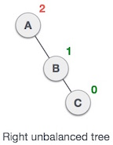
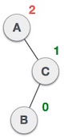
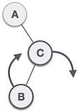
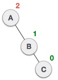

# Repaso de las últimas clases Arboles AVL

|SN|	Rotación|	Descripción|
|---|---|---|
|1|	LL| El nuevo nodo es insertado en el subarbol izquierdo del subarbol izquierdo de un nodo critico.|
|2|	RR| El nuevo nodo es insertado en el subarbol derecho del subarbol derecho de un nodo critico.|
|3|	LR| El nuevo nodo es insertado en el subarbol derecho del subarbol izquierdo de un nodo critico.|
|4|	RL| El nuevo nodo es insertado en el subarbol izquiedo del subarbol derecho de un nodo critico.|

La clase pasada ya vimos como hacer un balanceo cuando tenemos la condición `LL` , `RR` , `LR` y `RL`.

### Rotación Derecha (`LL`)

### Rotación Izquierda (`RR`)

### Rotación Izquierda Derecha (`LR`)

 
 
 
 

## Rotación Derecha Izquierda (`RL`)

 
 
 
 

# Analizar Borrado de nodos

## Rotación `R0`  (El nodo a borrar B tiene factor 0 )

Si el nodo B tiene un factor de balance 0, y el factor de balance del nodo A se altera al eliminar el nodo X, entonces el árbol se reequilibrará girando el árbol usando la rotación `R0`.

El nodo crítico A se mueve a su derecha y el nodo B se convierte en la raíz del árbol con T1 como su subárbol izquierdo. Los subárboles T2 y T3 se convierten en el subárbol izquierdo y derecho del nodo A. El proceso involucrado en la rotación `R0` se muestra en la  imagen.

### Ejemplo

Borrar el nodo->30 del árbol AVL que se muestra en la siguiente imagen.

En este caso, el nodo B tiene un factor 0, por lo tanto, el árbol se rotará utilizando la rotación `R0` como se muestra en la siguiente imagen. El nodo B->10 se convierte en la raíz, mientras que el nodo A se mueve a su derecha. El hijo derecho del nodo B ahora se convertirá en el hijo izquierdo del nodo A.

## Rotación `R1`  (El nodo a borrar B tiene factor 1 )

La rotación `R1` se debe realizar si el factor del nodo `B` es 1. En la rotación `R1`, el nodo crítico A se mueve hacia la derecha con los subárboles `T2` y `T3` como su hijo izquierdo y derecho respectivamente. `T1` se colocará como el subárbol izquierdo del nodo `B`.

### Ejemplo
Boorar el Nodo->55 del árbol AVL que se muestra en la siguiente imagen.

Eliminar 55 del árbol AVL perturba el factor de balance del nodo 50, es decir, el nodo A que se convierte en el nodo crítico. Esta es la condición de la rotación R1 en la cual, el nodo A se moverá a su derecha (como se muestra en la imagen a continuación). La derecha de B ahora se convierte en la izquierda de A (es decir, 45).

## Rotación `R-1`  (El nodo a borrar B tiene factor -1 )

La rotación R-1 se realizará si el nodo B tiene un factor de balance -1. Este caso se trata de la misma manera que la rotación LR. En este caso, el nodo C, que es el hijo derecho del nodo B, se convierte en el nodo raíz del árbol con B y A como sus hijos izquierdo y derecho, respectivamente.

Los subárboles T1, T2 se convierten en los subárboles izquierdo y derecho de B, mientras que T3, T4 se convierten en los subárboles izquierdo y derecho de A.

### Ejemplo
Borrar el nodo->60 del árbol AVL que se muestra en la siguiente imagen.

en este caso, el nodo B tiene un factor de equilibrio -1. Al eliminar el nodo 60, se altera el factor de equilibrio del nodo 50, por lo tanto, debe rotarse R-1. El nodo C, es decir, 45 se convierte en la raíz del árbol con el nodo B (40) y A (50) como su hijo izquierdo y derecho.

