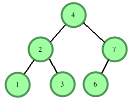
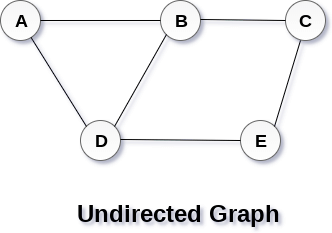
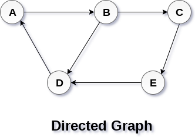
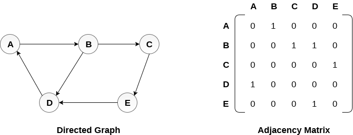
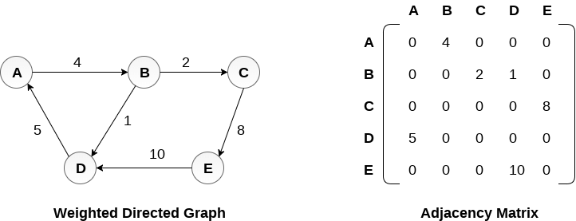
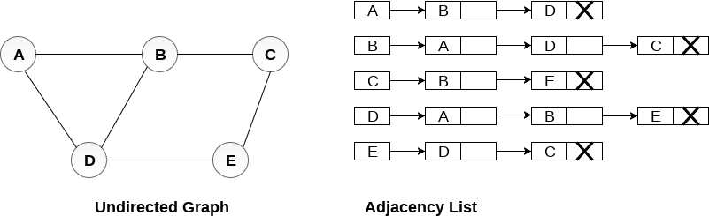
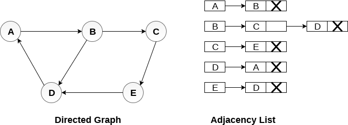
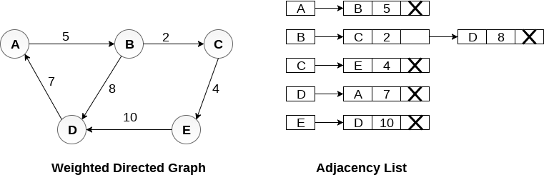

# Practica de Arboles

## Ejercicio 1
Crear una función que reciba la raiz de un arbol binario y que imprima lo que se conoce como `level order traversal` que se traduce como recorrido de orden por nivel, esto es, visitamos todos los nodos por nivel de izquierda a derecha.

Por ejemplo el reccorido por nivel del siguiente arbol:
```
     1
      \
       2
        \
         5
        /  \
       3    6
        \
         4 
```
es `1 -> 2 -> 5 -> 3 -> 6 -> 4`.

La estructura de la función seria:
```
template <typename T>
void levelOrder(Node<T> * root) {

}
```

Vamos a darles 25 minutos para resolverlo.

[solucion](codigos/clase_23_practica_01.cpp)

## Ejercicio 2

Binary Search Tree : Lowest Common Ancestor
Dado un BST y dos nodos de este arbol el encontrar el `Lowest Common Ancestor`, es decir, el nodo ancestro común más cercano a ambos nodos.

Dicho de otra manera, dado un arbol de busqueda binaria y dos valores `data1` y `data2` de dicho arbol, crear una función que encuentre el primer ancestro que sea común a ambos nodos(nodo padre o padre del padre o ....).

```
template <typename T>
Node *LowestCommonAncestor(Node<T> *root, int v1,int v2) {
     // Write your code here.
}

```
Ejemplo: `{4, 2, 1, 3, 7, 6}`




Vamos a darles 25 minutos para resolverlo.

[solucion](codigos/clase_23_practica_02.cpp)


# Grafos

Un grafo es una estructura de datos no lineal que consta de nodos y aristas. Los nodos a veces también se conocen como vértices y los bordes son líneas o arcos que conectan dos nodos en el grafo. Un grafo puede verse como un árbol cíclico, donde los vértices (nodos) mantienen una relación compleja entre ellos en lugar de tener una relación padre-hijo.

## Definición

Un grafo consiste en un conjunto finito de vértices (o nodos) y un conjunto de bordes que conectan un par de nodos.

Un grafo `G` puede definirse como un conjunto ordenado `G(V, E)` donde `V(G)` representa el conjunto de vértices y `E(G)` representa el conjunto de aristas que se utilizan para conectar estos vértices.

Por ejemplo:

un grafo `G(V, E)` con 5 vertices `(A, B, C, D, E)` y 6 aristas `((A,B), (B,C), (C,E), (E,D), (D,B), (D,A))`, una representación visual de este grafo es la siguiente:




- Ruta/Trayectoria(path): Una ruta se puede definir como la secuencia de nodos que se siguen para alcanzar algún nodo terminal V desde el nodo inicial U. Ejemplo: U=A, V=E, una ruta podria ser A->B->C->E.
- Ruta/Trayectoria Cerrada tambien llamado ciclo(path closed): Se llamará una ruta como ruta cerrada si el nodo inicial es el mismo que el nodo terminal. Una ruta será ruta cerrada si V0 = VN. Ejemplo: `U=A`, `V=A`, una ruta podria ser `A->B->C->E->D->A`.
- Ruta Simple(Simple path): Si todos los nodos del gráfico son distintos con una excepción `V0 = VN`, entonces dicha ruta `P` se llama ruta simple cerrada.
- Ciclo(cycle): Un ciclo se puede definir como la ruta que no tiene aristas o vértices repetidos, excepto el primero y último vértice.
- Grafo conectado: Un grafo conectado es aquel en el que existe alguna ruta entre cada dos vértices `(u, v)` en `V`. No hay nodos aislados en el grafo conectado.
- Grafo Completo: Un grafo completo es aquel en el que cada nodo está conectado con todos los demás nodos. Un gráfico completo contiene $\frac{n\cdot (n-1)}{2}$ aristas donde $n$ es el número de nodos en el gráfico.
- Grafo Ponderado: En un gráfico ponderado,es en el cual a cada arista se le asigna un peso, que podria ser longitud o peso de la arista. El peso de una arista `e` se puede denotar como `w(e)`, que debe ser un valor positivoque indique el costo de atravesar esa arista.
- Bigrafo: Un Bigrafo es un grafo dirigido en el que cada arista del grafo está asociada con alguna dirección y el desplazamiento solo se puede realizar en la dirección especificada.
- Loop: Una arista que se asocia con puntos finales similares se llama un Loop.
- Nodos adyacentes: Si dos nodos `u` y `v` están conectados a través de una arista `e`, entonces los nodos `u` y `v` se llaman nodos vecinos o adyacentes.
- Grado de un nodo: El grado de un nodo es el número de aristas que están conectadas con ese nodo. Un nodo con grado 0 se llama como nodo aislado.


## Aplicaciones de Grafos

Los grafos se usan para resolver muchos problemas de la vida real. Los grafos se usan para representar redes. Las redes pueden incluir rutas en una ciudad o red telefónica por ejemplo. Los grafos también se usan en redes sociales como LinkedIn, Facebook. Por ejemplo, en Facebook, cada persona está representada con un vértice (o nodo). Cada nodo es una estructura y contiene información como identificación de persona, nombre, género, configuración regional, etc.


## Tipos de Grafos

Basicamente tenemos dos tipos de grafos:
- Grafos Dirigidos
- Grafos NO dirigidos

En un gráfico no dirigido, los bordes no están asociados con direcciones, solo indican que ambos estan relacionados, estos es, si existe una arista entre el vértice `A` y `B`, entonces los vértices se pueden atravesar de `B` a `A`, así como de `A` a `B`.

Mientras que en un grafo dirigido, las aristas forman un par ordenado. Las aristas representan una ruta específica desde algún vértice `A` a otro vértice `B`. El nodo `A` se llama nodo inicial mientras que el nodo `B` se llama nodo final.



## Representaciones de Grafos

Las formas más comunes de representar grafos son:
1. Representacion Secuencial tambien conocida como Representacion Matriz de adyacencias.
2. Lista de Adyacencias

La representación que se use dependerá siempre del problema a resolver.

### Representacion con Matriz de adyacencias

En este caso utilizamos la matriz de adyacencia para almacenar el mapeo representado por vértices y aristas. En la matriz de adyacencia, las filas y columnas están representadas por los vértices del grafo. Un grafo que tiene $n$ vértices, tendrá una dimensión $n \times n$.

Una entrada $M_{ij}$ en la representación de matriz de adyacencia de un grafo `G` no dirigido será 1 si existe una arista entre $V_{i}$ y $V{j}$.


En la siguiente imagen se muestra un grafo no dirigido y su representación de matriz de adyacencia.


Podemos ver que el mapeo entre los vértices `(A, B, C, D, E)` se representa utilizando la matriz de adyacencia que también se muestra en la figura.


Existen diferentes matrices de adyacencia para el grafo dirigido y no dirigido. En el grafo dirigido, una entrada $A_{ij}$ será 1 solo cuando haya una arista dirigida de $V_{i}$ a $V_{j}$.

Ejemplo:




### Grafo ponderado

La representación del grafo dirigido ponderado es diferente. En lugar de llenar las entradas con 1s, las entradas distintas de cero de la matriz de adyacencia están representadas por el peso de las aristas respectivas.




### Representacion con lista de adyacencias

En la representación de listas ligadas, se usa una lista de adyacencia para almacenar el grafo.

Veamos el siguiente grafo no dirigido:



Tenemos una serie de listas ligadas y cada lista contiene todos los nodos vecinos al nodo raiz.

#### Grafo Dirigido



Tenemos una serie de listas ligadas y cada lista contiene todos los nodos vecinos al nodo raiz que pueden ser accedidos desde el nodo raiz.

#### Grafo Ponderado



Tenemos una serie de listas ligadas y cada lista contiene todos los nodos vecinos al nodo raiz que pueden ser accedidos desde el nodo raiz y ademas agregamos un valor que indica el costo de ir de raiz a ese nodo.

