# Grafos
## Representaciones de Grafos

Las formas más comunes de representar grafos son:
1. Representacion Secuencial tambien conocida como Representacion Matriz de adyacencias.
2. Lista de Adyacencias

La representación que se use dependerá siempre del problema a resolver.

### Representacion con Matriz de adyacencias

En este caso utilizamos la matriz de adyacencia para almacenar el mapeo representado por vértices y aristas. En la matriz de adyacencia, las filas y columnas están representadas por los vértices del grafo. Un grafo que tiene $n$ vértices, tendrá una dimensión $n \times n$.

Una entrada $M_{ij}$ en la representación de matriz de adyacencia de un grafo `G` no dirigido será 1 si existe una arista entre $V_{i}$ y $V{j}$.


En la siguiente imagen se muestra un grafo no dirigido y su representación de matriz de adyacencia.


Podemos ver que el mapeo entre los vértices `(A, B, C, D, E)` se representa utilizando la matriz de adyacencia que también se muestra en la figura.

[codigo](codigos/clase_24_practica_01.cpp)


Existen diferentes matrices de adyacencia para el grafo dirigido y no dirigido. En el grafo dirigido, una entrada $A_{ij}$ será 1 solo cuando haya una arista dirigida de $V_{i}$ a $V_{j}$.

Ejemplo:


[codigo](codigos/clase_24_practica_02.cpp)

### Grafo ponderado

La representación del grafo dirigido ponderado es diferente. En lugar de llenar las entradas con 1s, las entradas distintas de cero de la matriz de adyacencia están representadas por el peso de las aristas respectivas.


[codigo](codigos/clase_24_practica_03.cpp)

### Representacion con lista de adyacencias

En la representación de listas ligadas, se usa una lista de adyacencia para almacenar el grafo.

Una manera simple de guardar la lista de adyacencias es usar un arreglo de vectores, donde cada vector guarda la lista de nodos adyacentes.

Primero relacionamos cada nodo con un valor entre 0 y el número de nodos $n$.
```
A->0
B->1
C->2
D->3
E->4
```
Creamos un arreglo de vectores, que puede ser estatico o dinamico, o un vector de vectores.

```
vector<int> adj[n];//estatico
vector<int> *adj = new vector<int>[n];//dinamico
vector<vector<int>> adj;
Node adj[n];
Node **adj;
```
donde cada elemento del arreglo $adj_{i}$ es una lista de los nodos relacionados con $i$.

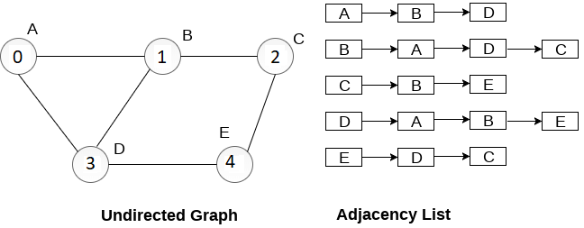

[codigo](codigos/clase_24_practica_04.cpp)


Veamos el siguiente grafo no dirigido:


Tenemos una serie de listas ligadas y cada lista contiene todos los nodos vecinos al nodo raiz.

[codigo](codigos/clase_24_practica_05.cpp)

#### Grafo Dirigido


Tenemos una serie de listas ligadas y cada lista contiene todos los nodos vecinos al nodo raiz que pueden ser accedidos desde el nodo raiz.

[codigo](codigos/clase_24_practica_06.cpp)

#### Grafo Ponderado


Tenemos una serie de listas ligadas y cada lista contiene todos los nodos vecinos al nodo raiz que pueden ser accedidos desde el nodo raiz y ademas agregamos un valor que indica el costo de ir de raiz a ese nodo.


[codigo](codigos/clase_24_practica_07.cpp)


# Recorrido de Grafos

Al igual que en el caso de arboles, los grafos pueden ser recorridos, sin embargo no es tan simple como en el caso de los arboles binarios.

Atravesar el grafo significa examinar todos los nodos/vértices del grafo. Existen dos métodos estándar mediante los cuales podemos atravesar los vertices de un grafo. 

- Breadth First Search (BFS)
- Depth First Search (DFS)

## Breadth First Search (BFS) 

Los grafos pueden contener ciclos, asi que al recorrer un grafo es posible terminar en un nodo que ya fue anteriormente visitado.
Para evitar procesar un nodo más de una vez, crearemos un arreglo binario(bitvector) de nodos visitados. 

El algoritmo BFS se usa para encontrar componentes conectados en un grafo fue inventado en 1945 por Konrad Zuse y  fue reinventado en 1959 por Edward F. Moore, quien lo usó para encontrar el camino más corto para salir de un laberinto, más tarde desarrollado por C. Y. Lee en un algoritmo de enrutamiento de cables.

Asumiremos que cualquier nodo es alcanzable, es decir, que no existen nodos aislados.

1. Escogemos un nodo/vertice `x` de del grafo `G` y lo ponemos en un queue(`Q`) y marcamos ese nodo como visitado en nuestro arreglo binario.
2. Mientras `Q` no sea vacio hacemos lo siguiente:
    - Desencolamos elemento `x` en `Q`
        - Imprimimos `x`.
        - Revisamos nodos adyacentes a `x` que no estan en la lista de visitados.
        - Para cada nodo no visitado adyacentes a `x`, colocamos dichos nodos el queue `Q`.
        - Repetimos...

Con esto hemos visitado todos los nodos del grafo `G`.

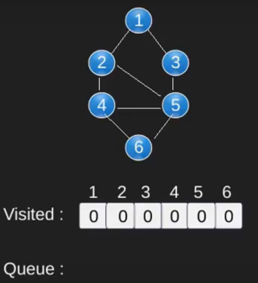 
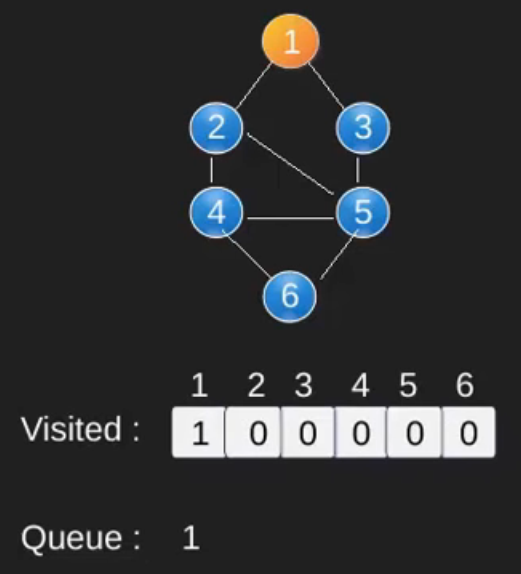 
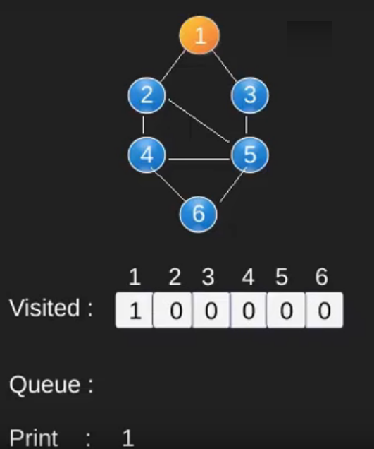 
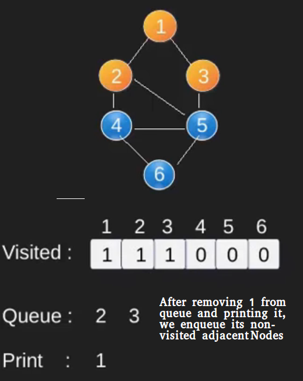 
<!-- -->
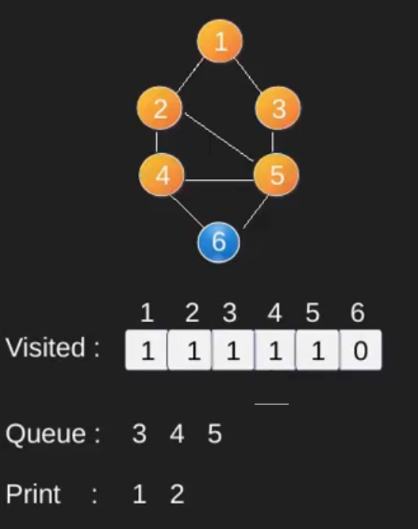 
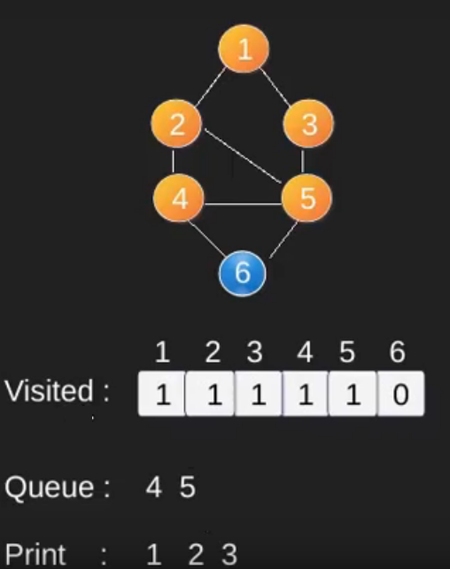 
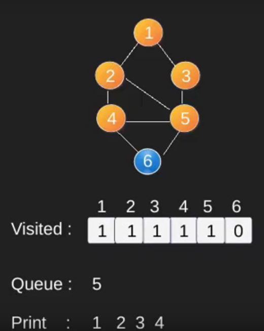 
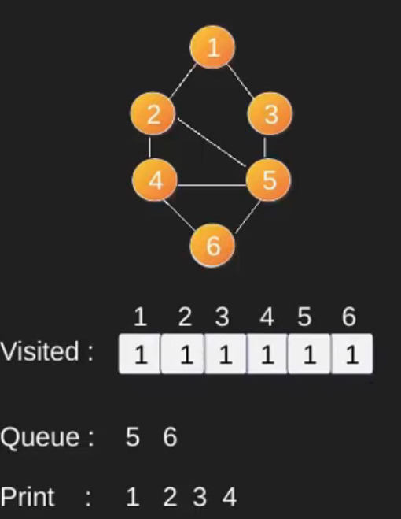 
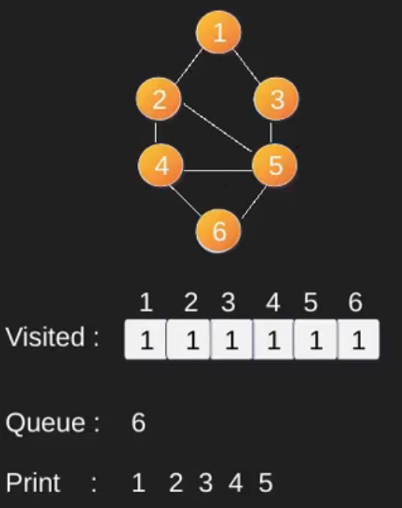 
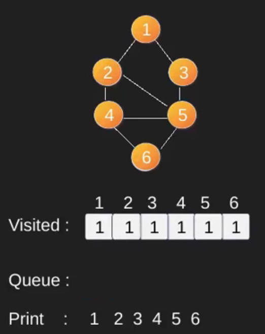 


### Pseudocodigo
```
BFS(grafo G, nodo_fuente s) 
  { 
     // recorremos todos los vértices del grafo inicializándolos a NO_VISITADO,
     // distancia INFINITA y padre de cada nodo NULL
     for u ∈ V[G] do
     {
        estado[u] = NO_VISITADO;
        distancia[u] = INFINITO; /* distancia infinita si el nodo no es alcanzable */
        padre[u] = NULL;
     }
     estado[s] = VISITADO;
     distancia[s] = 0;
     padre[s] = NULL;
     CrearCola(Q); /* nos aseguramos que la cola está vacía */
     Encolar(Q, s);
     while !vacía(Q) do
     {
        // extraemos el nodo u de la cola Q y exploramos todos sus nodos adyacentes
        u = extraer(Q);
        for  v ∈ adyacencia[u]  do
        {
           if estado[v] == NO_VISITADO then
           {
                estado[v] = VISITADO;
                distancia[v] = distancia[u] + 1;
                padre[v] = u;
                Encolar(Q, v);
           }
        }
     }
  }
```


### Implementar para un arbol no dirigido con representación matricial.