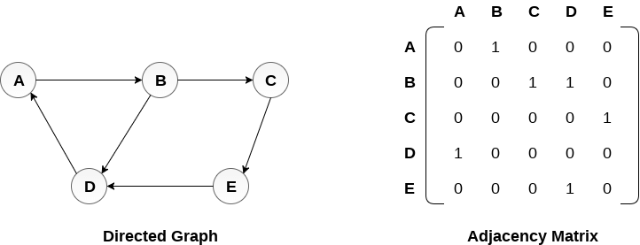
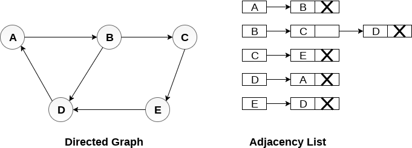

# Grafos
## Representaciones de Grafos

Las formas más comunes de representar grafos son:
1. Representacion Secuencial tambien conocida como Representacion Matriz de adyacencias.
2. Lista de Adyacencias

La representación que se use dependerá siempre del problema a resolver.

### Representacion con Matriz de adyacencias

En este caso utilizamos la matriz de adyacencia para almacenar el mapeo representado por vértices y aristas. En la matriz de adyacencia, las filas y columnas están representadas por los vértices del grafo. Un grafo que tiene $n$ vértices, tendrá una dimensión $n \times n$.

Una entrada $M_{ij}$ en la representación de matriz de adyacencia de un grafo `G` no dirigido será 1 si existe una arista entre $V_{i}$ y $V{j}$.


En la siguiente imagen se muestra un grafo no dirigido y su representación de matriz de adyacencia.


Podemos ver que el mapeo entre los vértices `(A, B, C, D, E)` se representa utilizando la matriz de adyacencia que también se muestra en la figura.

[codigo](codigos/clase_24_practica_01.cpp)


Existen diferentes matrices de adyacencia para el grafo dirigido y no dirigido. En el grafo dirigido, una entrada $A_{ij}$ será 1 solo cuando haya una arista dirigida de $V_{i}$ a $V_{j}$.

Ejemplo:



[codigo](codigos/clase_24_practica_02.cpp)

### Grafo ponderado

La representación del grafo dirigido ponderado es diferente. En lugar de llenar las entradas con 1s, las entradas distintas de cero de la matriz de adyacencia están representadas por el peso de las aristas respectivas.


[codigo](codigos/clase_24_practica_03.cpp)

### Representacion con lista de adyacencias

En la representación de listas ligadas, se usa una lista de adyacencia para almacenar el grafo.

Una manera simple de guardar la lista de adyacencias es usar un arreglo de vectores, donde cada vector guarda la lista de nodos adyacentes.

Primero relacionamos cada nodo con un valor entre 0 y el número de nodos $n$.
```
A->0
B->1
C->2
D->3
E->4
```
Creamos un arreglo de vectores, que puede ser estatico o dinamico, o un vector de vectores.

```
vector<int> adj[n];//estatico
vector<int> *adj = new vector<int>[n];//dinamico
vector<vector<int>> adj;
```
donde cada elemento del arreglo $adj_{i}$ es una lista de los nodos relacionados con $i$.


[codigo](codigos/clase_24_practica_04.cpp)


Veamos el siguiente grafo no dirigido:


Tenemos una serie de listas ligadas y cada lista contiene todos los nodos vecinos al nodo raiz.

[codigo](codigos/clase_24_practica_05.cpp)

#### Grafo Dirigido



Tenemos una serie de listas ligadas y cada lista contiene todos los nodos vecinos al nodo raiz que pueden ser accedidos desde el nodo raiz.

[codigo](codigos/clase_24_practica_06.cpp)

#### Grafo Ponderado


Tenemos una serie de listas ligadas y cada lista contiene todos los nodos vecinos al nodo raiz que pueden ser accedidos desde el nodo raiz y ademas agregamos un valor que indica el costo de ir de raiz a ese nodo.


[codigo](codigos/clase_24_practica_07.cpp)