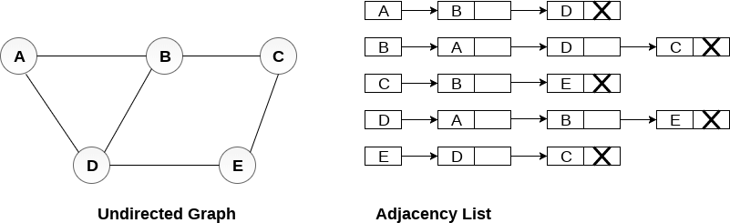

# Grafos
## Recorrido de Grafos

Al igual que en el caso de arboles, los grafos pueden ser recorridos, sin embargo no es tan simple como en el caso de los arboles binarios.

Atravesar el grafo significa examinar todos los nodos/vértices del grafo. Existen dos métodos estándar mediante los cuales podemos atravesar los vertices de un grafo. 

- Breadth First Search (BFS)
- Depth First Search (DFS)

## Breadth First Search (BFS) 

Asumiremos que cualquier nodo es alcanzable, es decir, que no existen nodos aislados.

1. Escogemos un nodo/vertice `x` de del grafo `G` y lo ponemos en un queue(`Q`) y marcamos ese nodo como visitado en nuestro arreglo binario.
2. Mientras `Q` no sea vacio hacemos lo siguiente:
    - Desencolamos elemento `x` en `Q`
        - Imprimimos `x`.
        - Revisamos nodos adyacentes a `x` que no estan en la lista de visitados.
        - Para cada nodo no visitado adyacentes a `x`, colocamos dichos nodos el queue `Q`.
        - Repetimos...

Con esto hemos visitado todos los nodos del grafo `G`.

Primero definiremos una clase para estructurar nuestro codigo, para ello usaremos la clase `list` que básicamente es una lista doblemente ligada, perfecta para insertar, extraer o cambiar el valor de elementos dentro de la lista:

```
class Graph {
private:
    int m_iV;// Numero de vertices
    std::list<int> *m_ptrAdj;// Apuntador a un arreglo que contiene las listas de adyacencias
    bool *visited;
public: 
    Graph();
    ~Graph();
    Graph(int V);
    void addEdge(int u, int v);
    void BFS(int s);// Recorrido BFS desde nodo s
}; 
```

### Ejemplo con grafo dirigido


[codigo](codigos/clase_25_practica_01.cpp)

### Ejemplo con grafo NO dirigido


[codigo](codigos/clase_25_practica_02.cpp)


## Deep First Search (DFS) 

Es casi lo mismo que el algoritmo BFS, pero en lugar de usar un queue para indicar que un nodo debe ser procesado, lo que hacemos es recorrer el arreglo de estados.
Este algoritmo puede ser implementador tanto de manera iterativa como de manera recursiva.

Estados:
- `1` Indica que ese nodo no ha sido descubierto o procesado.
- `2` Indica que ese nodo esta listo para ser procesado.
- `3` Indica que ese nodo ya fue procesado.

Asumiremos que cualquier nodo es alcanzable, es decir, que no existen nodos aislados.

1. Escogemos un nodo/vertice `x` de del grafo `G` y  marcamos ese nodo como alcanzable(estado `2`) en un arreglo de estados(en lugar de un arreglo binario ahora tenemos un arreglo de enteros).
2. Mientras existan nodos alcanzables hacemos lo siguiente:
    - Tomamos un elemento alcanzable `x` en el arreglo de nodos alcanzables:
        - Imprimimos `x`.
        - Marcamos el estado de `x` como procesado, es decir, estado `3`.
        - Revisamos nodos adyacentes a `x` que  estan en la lista de estados como no descubiertos(estado `1`).
        - Para cada nodo no visitado adyacentes a `x`, marcamos dichos nodos con el estado `2`.
        - Repetimos...

Con esto hemos visitado todos los nodos del grafo `G`.

Primero definiremos una clase para estructurar nuestro codigo, para ello usaremos la clase `list` que básicamente es una lista doblemente ligada, perfecta para insertar, extraer o cambiar el valor de elementos dentro de la lista:

```
class Graph {
private:
    int m_iV;// Numero de vertices
    std::list<int> *m_ptrAdj;// Apuntador a un arreglo que contiene las listas de adyacencias
    int *status;
public: 
    Graph();
    ~Graph();
    Graph(int V);
    void addEdge(int u, int v);
    void BFS(int s);// Recorrido BFS desde nodo s
}; 
```

### Ejemplo con grafo dirigido
En este caso como cada nodo es alcanzable realmente nos basta con dos estados(`no visitado`, `visitado`)


[codigo](codigos/clase_25_practica_03.cpp)

### Ejemplo con grafo NO dirigido


[codigo](codigos/clase_25_practica_04.cpp)


## Implementar el DFS utilizando el arreglo de estados, asumir que puede haber islas, o nodos que no son alcanzables.