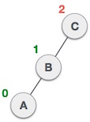

# Repaso del material

# Arboles AVL 

Los arboles AVL en honor a Adelson-Velsky-Landis, son arboles de busqueda binaria balanceados por altura, en los cuales a cada nodo se le asocia un factor de balance, el cual se calcula substrayendo la altura de su subarbol derecho menos la altura de su subarbol izquierdo. Este arbol no necesariamente es el más optimo pero fue uno de los primeros algoritmos para crear  arboles autobalanceables.

Para conseguir esta propiedad de balanceo tanto la inserción como el borrado de los nodos se debe realizar de una forma especial, donde básicamente se realizan las siguientes operaciones:

|SN|	Rotación|	Descripción|
|---|---|---|
|1|	LL| El nuevo nodo es insertado en el subarbol izquierdo del subarbol izquierdo de un nodo critico.|
|2|	RR| El nuevo nodo es insertado en el subarbol derecho del subarbol derecho de un nodo critico.|
|3|	LR| El nuevo nodo es insertado en el subarbol derecho del subarbol izquierdo de un nodo critico.|
|4|	RL| El nuevo nodo es insertado en el subarbol izquiedo del subarbol derecho de un nodo critico.|


La clase pasada ya vimos como hacer un balanceo cuando tenemos la condición `LL` o `RR`.


Hoy terminaremos con los casos `LR` y `RL`.


### Rotación Izquierda Derecha (`LR`)

 
 
 
 


## Rotación Derecha Izquierda (`RL`)

 
 
 
 

# Grafos

Un grafo es una estructura de datos no lineal que consta de nodos y aristas. Los nodos a veces también se conocen como vértices y los bordes son líneas o arcos que conectan dos nodos en el grafo. Un grafo puede verse como un árbol cíclico, donde los vértices (nodos) mantienen una relación compleja entre ellos en lugar de tener una relación padre-hijo.

Un grafo consiste en un conjunto finito de vértices (o nodos) y un conjunto de aristas que conectan un par de nodos.

Un grafo `G` puede definirse como un conjunto ordenado `G(V, E)` donde `V(G)` representa el conjunto de vértices y `E(G)` representa el conjunto de aristas que se utilizan para conectar estos vértices.

## Tipos de Grafos

Basicamente tenemos dos tipos de grafos:
- Grafos Dirigidos
- Grafos NO dirigidos

## Representaciones de Grafos

Las formas más comunes de representar grafos son:
1. Representacion Secuencial tambien conocida como Representacion Matriz de adyacencias.
2. Lista de Adyacencias

## Recorrido de Grafos

Al igual que en el caso de arboles, los grafos pueden ser recorridos, sin embargo no es tan simple como en el caso de los arboles binarios.

Atravesar el grafo significa examinar todos los nodos/vértices del grafo. Existen dos métodos estándar mediante los cuales podemos atravesar los vertices de un grafo. 

- Breadth First Search (BFS)
- Depth First Search (DFS)


# Ejercicios

Los siguientes ejercicios nos ayudarán a poder implementar algunos algoritmos sobre grafos.

Problema 1. Se les da un puntero a la raíz de un árbol binario. Imprimir la vista superior del árbol binario.

Vista superior significa que cuando miras el árbol desde la parte superior de los nodos, lo que verás se llamará la vista superior del árbol. 

Ejemplo:
```
   1
    \
     2
      \
       5
      /  \
     3    6
      \
       4
```
Resultado: 1 -> 2 -> 5 -> 6

[source problema](https://www.hackerrank.com/challenges/tree-top-view/problem)


Problema 2. Dado un BST, transfórmalo en un árbol de suma mayor donde cada nodo contiene la suma de todos los nodos mayores que ese nodo.


Problema 3. Un heap es una estructura de datos especial basada en un árbol binario completo. En general, los heap pueden ser de dos tipos:

- Max-Heap: en un Max-Heap, la clave/llave presente en el nodo raíz debe ser la mayor entre todas las claves/llaves presentes en todos sus elementos secundarios. La misma propiedad debe ser recursivamente verdadera para todos los subárboles en ese árbol binario.

- Min-Heap: En un Min-Heap, la clave/llave presente en el nodo raíz debe ser mínima entre todas las claves/llaves presentes en todos sus elementos secundarios. La misma propiedad debe ser recursivamente verdadera para todos los subárboles en ese árbol binario.


Implementar una clase Min-Heap usando un arreglo de enteros `Arr`. 


Es claro que la raiz se guarda en el elemento `Arr[0]`.
Dado el nodo `i` tenemos que:

|Referencia|Valor que se obtiene|
|---|---|
|`Arr[(i-1)/2]`|Es el padre del nodo `i`|
|`Arr[2*i+1]`|Es el hijo izquierdo|
|`Arr[2*i+2]`|Es el hijo derecho|

Deberán implementar las siguientes funciones: 
- GetMin(): devuelve el elemento raíz del Min-Heap. La complejidad de esta operación es `O(1)`.
- ExtractMin(): elimina el elemento mínimo de MinHeap. La complejidad  de esta operación es `O(logn)` ya que esta operación necesita mantener la propiedad de almacenamiento dinámica (llamando a heapify()) después de eliminar la raíz.
- DecreaseKey(): disminuye el valor de la clave/llave. La complejidad temporal de esta operación es `O(Logn)`. Si el valor clave/llave de disminución de un nodo es mayor que el padre del nodo, entonces no necesitamos hacer nada. De lo contrario, debemos recorrer hacia arriba para corregir la propiedad de heap no sea violada.
- Insert(): la inserción de una nueva clave/llave lleva tiempo `O(Logn)`. Agregamos una nueva clave/llave al final del árbol. Si la nueva clave/llave es mayor que su padre, entonces no necesitamos hacer nada. De lo contrario, debemos recorrer hacia arriba para corregir la propiedad del heap no sea violada.
- Delete(): eliminar una clave/llave también lleva tiempo `O(Logn)`. Reemplazamos la clave/llave que se eliminará con menos infinito(INT_MIN) llamando a `DecreaseKey()`. Después de `DecreaseKey()`, el valor menos infinito debe alcanzar la raíz, por lo que llamamos a `ExtractMin()` para eliminar la clave/llave.

