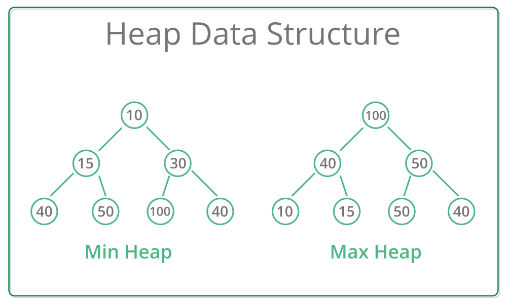
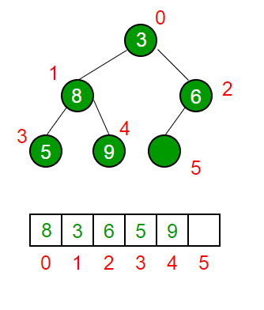

# Min-Heap Max-Heap
Hoy vamos a resolver el problema 3 de la clase pasada.

Problema 3. Un heap es una estructura de datos especial basada en un árbol binario completo. En general, los heap pueden ser de dos tipos:

- Max-Heap: en un Max-Heap, la clave/llave presente en el nodo raíz debe ser la mayor entre todas las claves/llaves presentes en todos sus elementos secundarios. La misma propiedad debe ser recursivamente verdadera para todos los subárboles en ese árbol binario.

- Min-Heap: En un Min-Heap, la clave/llave presente en el nodo raíz debe ser mínima entre todas las claves/llaves presentes en todos sus elementos secundarios. La misma propiedad debe ser recursivamente verdadera para todos los subárboles en ese árbol binario.




Implementar una clase Min-Heap usando un arreglo de enteros `Arr`. 


Es claro que la raiz se guarda en el elemento `Arr[0]`.
Dado el nodo `i` tenemos que:

|Referencia|Valor que se obtiene|
|---|---|
|`Arr[(i-1)/2]`|Es el padre del nodo `i`|
|`Arr[2*i+1]`|Es el hijo izquierdo|
|`Arr[2*i+2]`|Es el hijo derecho|

Deberán implementar las siguientes funciones: 
- GetMin(): devuelve el elemento raíz del Min-Heap. La complejidad de esta operación es `O(1)`.
- ExtractMin(): elimina el elemento mínimo de MinHeap. La complejidad  de esta operación es `O(logn)` ya que esta operación necesita mantener la propiedad de almacenamiento dinámica (llamando a heapify()) después de eliminar la raíz.
    - Primero asignamos obtenemos el valor de la raiz
    - Asignamos a la raiz el ultimo valor


    - Hacemos operaciones para volver a cumplir la propiedad de Heap(Min-Heap en este caso).




- DecreaseKey(): disminuye el valor de la clave/llave. La complejidad temporal de esta operación es `O(Logn)`. Si el valor clave/llave de disminución de un nodo es mayor que el padre del nodo, entonces no necesitamos hacer nada. De lo contrario, debemos recorrer hacia arriba para corregir la propiedad de heap no sea violada.
- Insert(): la inserción de una nueva clave/llave lleva tiempo `O(Logn)`. Agregamos una nueva clave/llave al final del árbol. Si la nueva clave/llave es mayor que su padre, entonces no necesitamos hacer nada. De lo contrario, debemos recorrer hacia arriba para corregir la propiedad del heap no sea violada.
- Delete(): eliminar una clave/llave también lleva tiempo `O(Logn)`. Reemplazamos la clave/llave que se eliminará con menos infinito(INT_MIN) llamando a `DecreaseKey()`. Después de `DecreaseKey()`, el valor menos infinito debe alcanzar la raíz, por lo que llamamos a `ExtractMin()` para eliminar la clave/llave.

[codigo](codigos/clase_27_practica_01.cpp)


## Implementar Max-Heap

[codigo](codigos/clase_27_practica_02.cpp)

# Unit Testing

## ¿Qué es el Unit Testing?

El Unit Testing o prueba de unidad tiene como objetivo verificar/validar partes individuales de  código fuente por separado. Una unidad aquí es la parte más pequeña del código que se puede probar de forma aislada, por ejemplo, una función libre o un método de clase.

El Unit Testing es un protocolo que existe desde hace más de 30 años(~1987). El protocolo lo pueden buscar simplemente como TAP, que significa Test Anything Protocol, algo asi como protocolo para testear cualquier cosa.

## ¿Para qué sirve el unit testing?

- Te ayuda a verificar que nuevo código no daña funciones/metodos previamente codificados, está diría es la principal función del Unit Testing.
- Te obliga a modularizar tu código, para poder realizar buenas pruebas unitarias, muchas veces, esto es conocido como `TDD`, Test Driven Development, es decir, si sabes que quieres que haga tu función/metodo entonces sabes como validarlo, con lo cual puedes inclusive crear la prueba antes de que exista el código que lo resuelve. Y en lugar de tratar de hacer una función que sea demasiado general, tienes una función que resuelve exactamente lo quieres resolver, ahorrando mucho tiempo de desarrollo.
- Es una forma de documentar código indirectamente, pruebas bien nombradas, te permiten seguir el flujo del funcionamiento del código.

## Como organizar el unit testing

Una prueba unitaria se veria como la siguiente función:

```
Test (<Nombre del grupo de pruebas>, <nombre de la prueba específica>)   {
    1 - configuración del bloque de codigo
    2 - correr funciones a probar
    3 - revisar resultados
}
```

## Buenas practicas en Pruebas Unitarias

- Crear pruebas para todas las funciones publicas o que pueden ser accedidas fuera de la clase, lo cual incluye a los constructores de clase y los operadores.
- Cubrir todas las rutas de código y comprobar los casos triviales y extremos, esto es una caracteristica básica de ingenieria de software, inclusive probar con datos de entrada incorrectos, **que deberia devolver su programa cuando tenemos datos incorrectos**!!!
- Asegurarse de que cada prueba funcione de forma independiente y no impida la ejecución de otras pruebas, esto normalmente se logra organizando las pruebas de manera que el orden en que se ejecuten no afecte los resultados.
- Agrupar pruebas que usen los mismos datos.
- Las pruebas deben ser independientes y repetibles. Es difícil depurar una prueba que tiene éxito o falla como resultado de otras pruebas. 
- Las pruebas deben estar bien organizadas y reflejar la estructura del código probado. Es especialmente útil cuando las personas cambian de proyecto y comienzan a trabajar en una nueva base de código.
- Las pruebas deben ser portables y reutilizables. 
- Cuando las pruebas fallan, deben proporcionar tanta información sobre el problema como sea posible.
- Las pruebas deben ser rápidas.


En el mercado hay varias herramientas/frameworks para realizar unit testing, inclusive pueden, crear su propio framework usando simplemente el protocolo TAP. 

- CppUnit
- Boost.Test
- CppUnitLite
- NanoCppUnit
- Unit++
- CxxTest

Donde CppUnit es uno de los más utilizados. En esta clase veremos como utilizar `gtest` .

[source](https://github.com/google/googletest)

[documentación](https://github.com/google/googletest/blob/master/googletest/docs/primer.md)


## gtest

Google Test (`gtest`) es una biblioteca de pruebas unitarias para C++, basada en la arquitectura xUnit. Permite realizar pruebas unitarias de codigo fuente en C y C ++ con una modificación pequeña en el código fuente.

En Google Test, las declaraciones que verifican si una condición es verdadera se denominan aserciones. Las aserciones no fatales tienen el prefijo `EXPECT_` en sus nombres, y las aserciones que causan fallas fatales y anulan la ejecución se nombran comenzando con `ASSERT_`. Por ejemplo:

```
TEST (SumTest, IntFloatNegSum) {
    EXPECT_EQ (9, (3+2)); // fail, test continues
    ASSERT_EQ (0.0, (0.0)); // success
    ASSERT_EQ (1, (3)+(-3.0)); // fail, test interrupts
    ASSERT_EQ (0, (-3)+(-3.0));// not executed due to the previous assert
}
```
Algunas de las aserciones(EXPECT_EQ/ASSERT_EQ) disponibles en Google Test son: 

### Logicas

```
ASSERT_TRUE(condition)
ASSERT_FALSE(condition)
```

### Comparacion General

```
ASSERT_EQ(expected, actual) / ASSERT_NE(val1, val2)
ASSERT_LT(val1, val2) / ASSERT_LE(val1, val2)
ASSERT_GT(val1, val2) / ASSERT_GE(val1, val2)
```
### Comparación de punto flotante

```
ASSERT_FLOAT_EQ(expected, actual)
ASSERT_DOUBLE_EQ(expected, actual)
ASSERT_NEAR(val1, val2, abs_error)
```

### Comparación de cadena de carácteres

```
ASSERT_STREQ(expected_str, actual_str) / ASSERT_STRNE(str1, str2)
ASSERT_STRCASEEQ(expected_str, actual_str) / ASSERT_STRCASENE(str1, str2)
```

### Revisión de excepción

```
ASSERT_THROW(statement, exception_type)
ASSERT_ANY_THROW(statement)
ASSERT_NO_THROW(statement)
```

## Extras de gtest

Google Test permite usar aserciones con predicados, que ayudan a que los mensajes de salida sean más informativos. 

Por ejemplo, en lugar de `EXPECT_EQ (a, b)` se puede usar una función de predicado que verifica la equivalencia de `a` y `b` y devuelve un resultado booleano. En caso de falla, la aserción imprimirá valores de los argumentos de la función:

```
bool IsEq(int a, int b){
    if (a==b){
        return true;
    }else {
        return false;
    }
}

TEST(BasicChecks, TestEq) {
    int a = 0;
    int b = 1;
    EXPECT_EQ(a, b);
    EXPECT_PRED2(IsEq, a, b);
}
```
La primer prueba devuelve:
```
Failure
    Value of: b
    Actual: 1
    Expected: a
    Which is: 0
```
Mientras que la segunda nos devuelve:
```
Failure
    IsEq(a, b) evaluates to false, where
    a evaluates to 0
    b evaluates to 1

```
lo cual hace mas legible los resultados del unit testing. Usamos `EXPECT_PRED2` por que la función de ejemplo tiene 2 parametros.

Las principales carácteristicas de gtest son:
- Portable
- Tiene aserciones fatales, no fatales y advertencias, lo cual nos ayuda a evitar correr todas las pruebas cuando una falla critica se presente, entre otras posibilidades.
- Facil manera de crear mensajes.
- Detección automatica de nuevas pruebas.
- Posibilidad de ampliar el vocabulario de las aserciones.
- Selección de test a correr.
- Reportes XML
- Fixtures / Mock / Templates
- Entre otros...

## Evitemos confusiones con otros frameworks

Históricamente, googletest comenzó a usar el término `Test Case` para agrupar pruebas relacionadas, mientras que las publicaciones actuales, incluidos los materiales de la Junta Internacional de Calificaciones de Pruebas de Software (ISTQB) y varios libros de texto sobre calidad de software, usan el término `Test Suite` para esto.

El termino `Test` corresponde con el usual de `Test Case` de ISTBQ.

En esta clase usaremos `Test Suite` que es de lo más usual.

## Ahora instalen gtest sigan las intrucciones que les da el repositorio de git de gtest.


