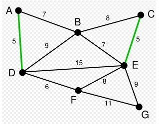
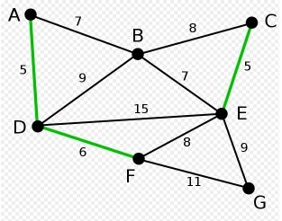
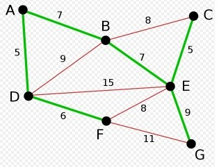

# Grafos
## Arboles de expansión (Spanning Tree)

El árbol de expansión se puede definir como un sub-grafo del grafo `G` conectado y no dirigido que es un árbol producido al eliminar un número deseado de ariestas de un grafo. Un grafo `G` puede tener múltiples árboles de expansión. Dicho de otra manera, un árbol de expansión `T` de un grafo `G` no dirigido es un subgrafo que a su vez es un árbol que incluye todos los vértices de `G`, con un mínimo número posible de aristas. 

## Algunas aplicaciones de arboles de expansión son:

- Planeación de redes ferroviarias.
- Planeación de caminos.
- Protocolos de ruteo en internet.
- Analisis de clusters.

## Arbol de expansión mínima (MST)

Cuando un grafo `G` tiene pesos asignados en cada arista, es decir, es un grafo ponderado. Podemos definir lo que se conoce como  un árbol de expansión mínimo, este es un árbol de expansión que tiene un peso total mínimo. En otras palabras, el árbol de expansión mínimo es el que contiene el menor peso entre todos los demás árboles de expansión que pueden crearse.

Para calcular el árbol de peso mínimo existen 2 algoritmos clásicos:

- Prim: Consiste en ir borrando las aristas de mayor peso posible y que no sean aristas de separación.

- Kruskal: Se van escogiendo las aristas de menor peso hasta conseguir un árbol de peso mínimo

### Prim

Pasos para realizar el algoritmo:

1. Se marca un nodo cualquiera, será el nodo de partida.

2. Seleccionamos la arista de menos valor incidente en el nodo marcado anteriormente, y marcamos el otro nodo en el que incide.

3. Repetir el paso 2 siempre que la arista elegida enlace un nodo y otro que no lo esté.

4. El proceso termina cuando tenemos todos los nodos del grafo marcados.

Primero creemos de nuevo una clase Graph que contendra un arreglo de nodos donde guardaremos la lista de adyacencias: [codigo](codigos/clase_29_practica_01.cpp)

Una vez que tenemos nuestro grafo, ahora si implementamos el algoritmo de PRIM: [codigo](codigos/clase_29_practica_02.cpp)

Ahora modifiquen el codigo anterior y realicen las praticas indicadas: [codigo](codigos/clase_29_practica_03.cpp)

### Kruskal

Inicialmente se ordenan las aristas por su peso. A continuación se van eligiendo las aristas de menor peso de modo tal, que no formen un ciclo con las aristas anteriormente seleccionadas. Para evitar que se formen ciclos se asignan etiquetas a los vértices de modo que los vértices que formen parte de las aristas ya elegidas tengan todos la misma etiqueta. Una etiqueta es una información asociada a un vértice que los hace distinguibles entre sí.

1. Inicializamos $T= \left\{ \right\}$

2. Asignar etiquetas a todos los vértices 

$$ t(i)=i,  \qquad i=1, 2, ..., n $$

3. Mientras haya vértices con etiquetas diferentes repetir.

    a) Escoger la arista $(u, v)$ de menor peso tal que $t(u)$ sea diferente de $t(v)$ . Agregarla a $T$

    b) Asignar a todos los vértices de una componente conexa de $T$ la misma etiqueta.

Marcamos las aristas con menos peso:

->
->
->
->

## Siguiente clase veremos algoritmos de trayectorias más cortas

## Referencias de Teoria de Graficas

- Combinatorics. A Problem-Based Approach. Pavle Mladenović

