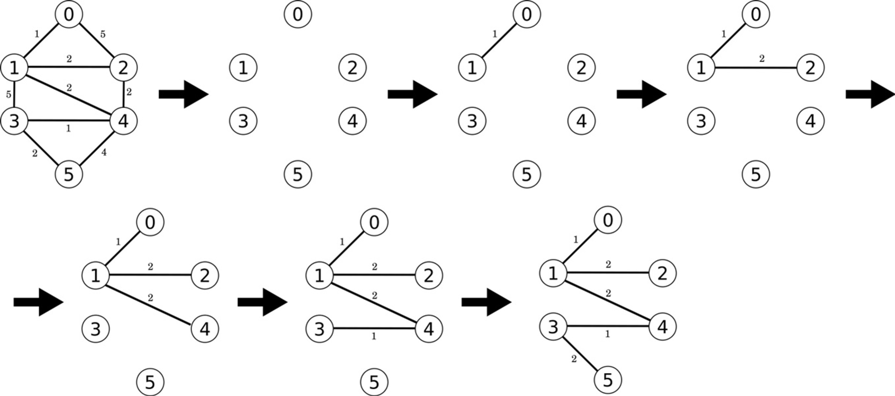
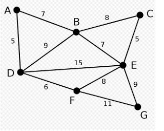
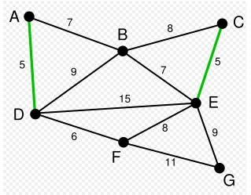
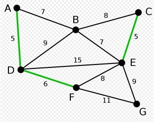
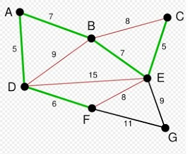
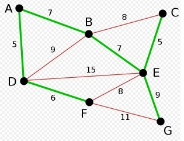

# Grafos (Continuación)
### Prim

Ahora terminaremos de revisar el código que empezamos la clase pasada, donde generamos un  grafo de expansion minima.




[codigo](codigos/clase_30_practica_01.cpp)

Primero liberamos memoria al terminar de usar nuestro grafo, creando una función que libera la memoria de una lista ligada:
```
template <typename T>
void BorraListaLigada(Node<T> *root){
    Node<T> *temp = root;
    Node<T> *aux;
    while(temp != NULL){
        aux = temp->next;
        delete temp;
        temp = aux;
    }
}
```
Finalmente usamos la función para liberar las listas de adyacencias del grafo instanciado:
```
template <typename T>
Graph<T>::~Graph(){ 
    int V = m_iV; 
    for(int i = 0;i < V;++i){
        BorraListaLigada(m_ptrAdj[i]);
    }
    delete [] m_ptrAdj;
}
```

La segunda practica era mejorar nuestra función `UpdateKeyParent`, donde actualizamos tanto el costo, como el valor del nodo al que se une un nodo fuera del arbol de expansión minima.

```
template<typename T>
void UpdateKeyParent(Graph<T> &g, int u, T *key, bool *mst_flags, int *parent){
    int V = g.getV();
    for(int v = 0; v < V;++v){
        Node<T> *temp = g.getNodeAdyacencias(v);
        temp = temp->next;
        while(temp != NULL){
            g.contador1++;
            int u_ = temp->data;
            int peso = temp->weight;
            if(u_ == u){
                if(mst_flags[v] == false){
                    if(peso < key[v]){
                        parent[v] = u;
                        key[v] = peso;
                    }
                }
            }
            temp = temp->next;
        }
    }
} 
```
En este código estamos viendo a donde se deberá unir el vertice `u`.
- recorremos todos los nodos `v` en `G`
- para cada nodo `v` recorremos su lista de adyacencias(sus vecinos)
- si el nodo en la lista de adyacencias corresponde con `u`
    - verificamos si el nodo `v` no se encuentra en `G`, de no encontrarse, revisamos el peso/costo que tiene unir `v` al actual subgrafo MST, si es menor, actualizamos el peso, y ponemos a `u` como actual padre de `v`. 

Como finalmente solo estamos verificando los vecinos de `u`, basta revisar los nodos vecinos de `u` que no han sido agregados, el que tenga menor peso será agregado. Con esto optimizamos dramaticamente el performance de nuestra aplicación.
```
template<typename T>
void UpdateKeyParent2(Graph<T> &g, int u, T *key, bool *mst_flags, int *parent){
    int V = g.getV();
    Node<T> *u_list = g.getNodeAdyacencias(u);
    Node<T> *temp = u_list->next;
    while( temp != NULL ){
        g.contador2++;
        int v = temp->data;
        int peso = temp->weight;
        if(mst_flags[v] == false){
            if(peso < key[v]){
                parent[v] = u;
                key[v] = peso;
            }
        }
        temp = temp->next;
    }
}
```
Agregando un par de contadores al grafo podemos ver cuntos nodos fueron accesados:
```
Contador1: 108
Contador2: 18
```

Por último debemos calcular la suma de todos los pesos del arbol de expansión mínima.

Vamos a cambiar un poco el código de la función `PrimMST`, para que los arreglos `parent`,`key` y `mst_flags` puedan ser accedidos después de terminar `PrimMST`.

[codigo](codigos/clase_30_practica_02.cpp)

Con esto solo basta sumar los pesos en `key`:
```
template <typename T>
T suma(Graph<T> &g,T* &key){
    int V = g.getV();
    T suma = T(0);
    for(int i = 0; i < V;++i){
        std::cout << "Peso nodo " << i <<" : "<< key[i] << std::endl;
        suma += key[i];
    }
    std::cout << "Peso total: " << suma << std::endl;
    return suma;
}
```
#### Practica extra clase
De practica, creen un grafo con los resultados obtenidos de `parent`,`key` y `mst_flags`, y modifiquen BFS para obtener la suma de los pesos.


### Kruskal

Inicialmente se ordenan las aristas por su peso. A continuación se van eligiendo las aristas de menor peso de modo tal, que no formen un ciclo con las aristas anteriormente seleccionadas. Para evitar que se formen ciclos se asignan etiquetas a los vértices de modo que los vértices que formen parte de las aristas ya elegidas tengan todos la misma etiqueta. Una etiqueta es una información asociada a un vértice que los hace distinguibles entre sí.

1. Inicializamos $T= \left\{ \right\}$

2. Asignar etiquetas a todos los vértices 

$$ t(i)=i,  \qquad i=1, 2, ..., n $$

3. Mientras haya vértices con etiquetas diferentes repetir.

    a) Escoger la arista $(u, v)$ de menor peso tal que $t(u)$ sea diferente de $t(v)$ . Agregarla a $T$

    b) Asignar a todos los vértices de una componente conexa de $T$ la misma etiqueta.



Marcamos las aristas con menos peso:

->
->
->
->


[codigo](codigos/clase_30_practica_03.cpp)

## Siguiente clase veremos algoritmos de trayectorias más cortas

## Referencias de Teoria de Graficas

- Combinatorics. A Problem-Based Approach. Pavle Mladenović

## Algunas herramientas visuales para estudiar grafos

[WebGato](https://schliep.org/CATBox/WebGato/index.html)

[TSP](http://www.math.uwaterloo.ca/tsp/index.html)