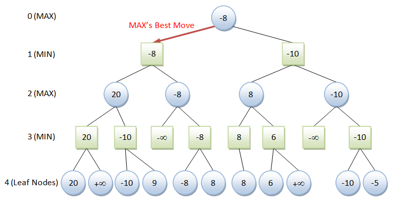
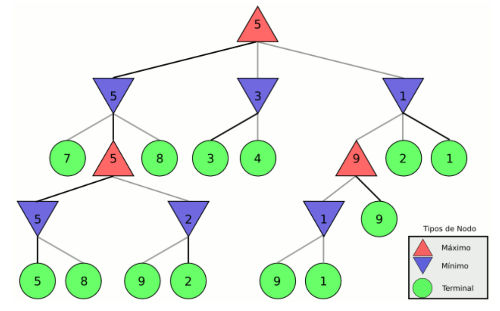
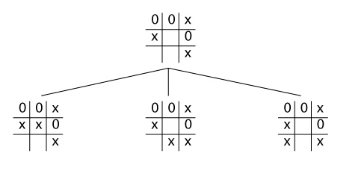
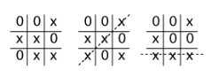
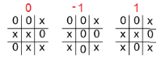
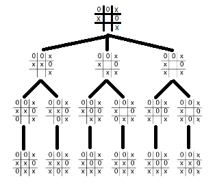
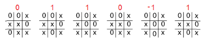
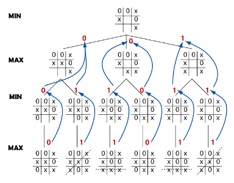

# Algoritmo MinMax

En teoría de juegos, MinMax (tambien llamado minimax) es un algoritmo de decisión para minimizar la pérdida máxima esperada en juegos con adversario y con información perfecta.

La idea más básica es cómo elegir el mejor movimiento para ti mismo suponiendo que tu contrincante escogerá el peor para ti.

## Historia

John von Neumann puso las bases de la teoría de juegos moderna y probó el teorema fundamental del MinMax, por el que se demuestra que para juegos de suma cero con información perfecta entre dos competidores existe una única solución óptima.


Primero hay que contestar la pregunta ¿Qué es un Juego?
```
Un juego es una situación conflictiva en la que uno debe tomar una decisión sabiendo que los demás también toman decisiones, y que el resultado del conflicto se determina, de algún modo, a partir de todas las decisiones realizadas.
```
Y lo que no es tán trivial es que:
```
Siempre existe una forma racional de actuar en juegos de dos participantes, si los intereses que los gobiernan son completamente opuestos.
``` 

Así como existe el MinMax existe el MaxMin.

La formulación matemática es:
The minimax value of a player is the smallest value that the other players can force the player to receive, without knowing the player's actions; equivalently, it is the largest value the player can be sure to get when they know the actions of the other players. Its formal definition is:[3]

$${\displaystyle {\overline {v_{i}}}=\min _{a_{-i}}\max _{a_{i}}{v_{i}(a_{i},a_{-i})}}{\overline {v_{i}}}=\min _{a_{-i}}\max _{a_{i}}{v_{i}(a_{i},a_{-i})}$$

Donde:

- $i$ es el indice del jugador.
- $-i$  denota al resto de jugadores excepto $i$.
- $a_{i}$ Es la acción del jugador $i$.
- $a_{{-i}}$ denota las aacciones del resto de jugadores.
- $v_{i}$ es el valor de la función del jugador $i$.

## Pasos del algoritmo minimax:

1. Generación del árbol de juego. Se generarán todos los nodos hasta llegar a un estado terminal.
2. Cálculo de los valores de la función de utilidad para cada nodo terminal.
Ejemplo de función: Juego de ajedrez

F(tablero final): Suma de los valores de las piezas que tengo, menos la suma de los valores de las piezas de mi enemigo.

Tablero final:
- Jugador 1:
    - Rey(1000)
    - 2 Afiles(10)
    - 1 Torre(10)
    - Peon(4)

- Jugador 2:
    - 1 Afiles(10)
    - 1 Torre(10)
    - Peon(2)

F(Tablero Final) =
(1000*1+2*10+1*10+4)-(1*10+1*10+2) = 1034-22 = 1013

3. Calcular el valor de los nodos superiores a partir del valor de los inferiores. Según nivel si es MAX o MIN se elegirán los valores mínimos y máximos representando los movimientos del jugador y del oponente, de ahí el nombre de MinMax.

4. Elegir la jugada valorando los valores que han llegado al nivel superior.




El algoritmo explorará los nodos del árbol asignándoles un valor numérico mediante una función de evaluación, empezando por los nodos hojas y subiendo hacia la raíz. La función de utilidad definirá lo buena que es la posición para un jugador cuando la alcanza. En el caso del ajedrez los posibles valores son (+1,0,-1) que se corresponden con ganar, empatar y perder respectivamente. Para cada juego pueden ser diferentes.

Como existen muchos tipos de juegos, vamos a considerar solo aquellos en los que se verifican las siguientes condiciones:

- Es determinista.
- De dos jugadores.
- Basado en turnos.
- De suma nula: lo que un jugador gana, lo pierde el otro.
- Con información perfecta: cada jugador tiene conocimiento completo del estado del mundo en todo momento.


## Ejemplo

En el siguiente ejemplo puede verse el funcionamiento de minmax en un árbol generado para un juego imaginario. Los posibles valores de la función de utilidad tienen un rango de [1-9]. En los movimientos del contrincante suponemos que escogerá los movimientos que minimicen nuestra utilidad, en nuestros movimientos suponemos que escogeremos los movimientos que maximizan nuestra utilidad.



El primer paso será calcular los nodos terminales, en verde. Posteriormente calcularemos el cuarto nivel, movimiento min, minimizando lo elegido (5, 2 y 1). Después podremos calcular el tercer nivel, movimiento max, maximizando la utilidad (5, 9). El segundo nivel es un movimiento min (5, 3 y 1). Finalmente llegamos al primer nivel, el movimiento actual, elegiremos el nodo que maximice nuestra utilidad (5).

Veamos un ejemplo un poco mas concreto, consideremos el juego del gato.

En el algoritmo MinMax el espacio de búsqueda queda definido por:

`Estado inicial`: Es una configuración inicial del juego, es decir, un estado en el que se encuentre el juego. Para nuestro ejemplo sería

| O | O | X |
|---|---|---|
| X |   | O |
|   |   | X |

`Operadores`: Corresponden a las jugadas legales que se pueden hacer en el juego, en el caso del gato no puedes marcar una casilla ya antes marcada.
Con el estado inicial solo tenemos las siguientes tres posibilidades:



`Condición Terminal`: Determina cuando el juego se acabó, en nuestro ejemplo el juego termina cuando un jugador marca tres casillas seguidas iguales, ya se horizontalmente, verticalmente o en diagonal, o se marcan todas las casillas (empate).



`Función de Utilidad`: Da un valor numérico a una configuración final de un juego. En un juego en donde se puede ganar, perder o empatar, los valores pueden ser `1`, `0`, o `-1`.




`Implementación Minimax`: Los pasos a seguir son:

El algoritmo primero generar un árbol de soluciones completo a partir de un nodo dado. veamos el siguiente ejemplo:



Para cada nodo final, buscamos la función de utilidad de estos. En nuestro ejemplo usaremos un 0 para las partidas que terminen en empate, un 1 para las que gane la IA y un -1 para las que gane el jugador humano.



Y lo que hará el algoritmo MinMax cuando vaya regresando hacia atrás, será comunicarle a la llamada recursiva superior cuál es el mejor nodo hoja alcanzado hasta el momento. Cada llamada recursiva tiene que saber a quién le toca jugar, para analizar si el movimiento realizado pertenece a la IA o al otro jugador, ya que cuando sea el turno de la IA nos interesa MAXIMIZAR el resultado, y cuando sea el turno del rival MINIMIZAR su resultado.




### En resumen

- Dado un estado, generamos todos los posibles movimientos
- Llegando al estado final, calculamos la funcion de utilidad.
- Calculamos Nivel por nivel MinMax alternando en cada nivel.
 


## En problemas complejos

En la práctica el método minmax es impracticable excepto en supuestos sencillos. Realizar la búsqueda completa requerirían cantidades excesivas de tiempo y memoria.


## Vamos a empezar una implemetación de minmax para el juego del gato

- Implementar una clase para guardar un estado inicial
- Implementar la función que genera todos los posibles estados apartir de un estado incial


### Referencias

1. [Beal Thesis](https://project.dke.maastrichtuniversity.nl/games/files/phd/Beal_thesis.pdf)