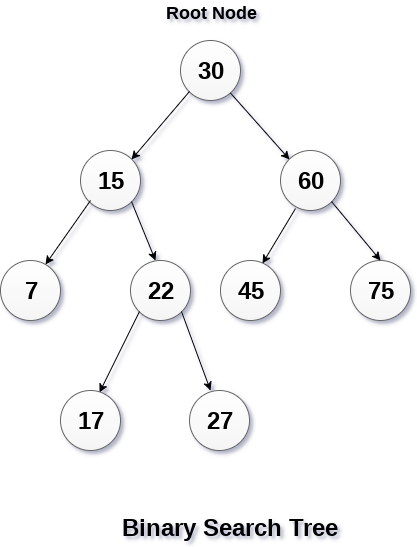

# Exámen Parcial 2
## Estructuras de datos
## 12 de Mayo de 2020

Enviar documento con respuestas antes de de las 8:45.

1. La complejidad de cuatro algoritmos son `O(2n)`, `O(logn)`, `O(n3)` y `O(n)` respectivamente. Cuando `n` es muy grande, ¿cuál de los cuatro algoritmos es el más eficiente?

- a) `O(2n)`
- b) `O(logn)`
- c) `O(n^3)`
- d) `O(n)`

2. Crear una función que sume los elementos de una lista simplemente ligada de enteros recursivamente.

3. Crear una función que sume los elementos de una lista simplemente ligada de enteros de manera iterativa.

4. ¿Qué imprime el siguiente código?
```
int cuenta(numero){
    numero -= 1
    if(numero > 0){
        std::cout << numero <<" ";
        cuenta(numero)
    }
}
int main(){
    cuenta(10);
    return 0;
}
```  

5. En el siguiente árbol binario de búsqueda ¿Cuál es el resultado de su recorrido inorden?




6. En el siguiente árbol binario de búsqueda, al borrar el nodo 22 ¿por qué otro nodo podrá ser reemplazado para que el árbol reultante siga siendo un árbol binario de búsqueda?


- a) 30
- b) 15
- c) 60
- d) 17

7. En el siguiente árbol binario de búsqueda se quiere buscar el elemento 22, ¿cuántas llamadas se realizarán a la función buscar?


- a) 0
- b) 1
- c) 2
- d) 3

8. Si se construye un arbol de busqueda binaria con los siguientes valores `{11, 6, 8, 19, 4, 13, 5, 17, 43, 49, 16, 31, 32}`, ¿Cual es el hijo izquierdo de nodo con el valor 43?

- a) 31
- b) 49
- c) 19
- d) 13

9. En el peor caso, cual es la complejidad del recorrido en postorden de un arbol de busqueda binaria con `n` nodos:

- a)   `O(log n)`
- b)   `O(n)`
- c)   `O(n * log n)`
- d)   `O(n^2)`


10. En un arbol de busqueda binaria, el elemento más grande debe cumplir:

- a)   ser un nodo raiz.
- b)   ser un nodo hoja.
- c)   debe tener al menos un hijo.
- d)   tiene a lo más un hijo.


