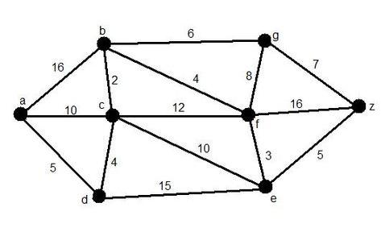

# Exámen Parcial 3
## Estructuras de datos
## 16 de Junio de 2020

Enviar documento con respuestas antes de de las 8:45.

1. En arboles generalmente existen nodos que no tienen ramificaciones, estos nodos reciben el nombre de: 

 - a. Padre 
 - b. Hermanos 
 - c. Hijos
 - d. Hojas  

2. En árboles el nodo que no tiene padre se le conoce como:

 - a. Nodo terminal
 - b. Nodo hijo
 - c. Nodo hoja
 - d. Nodo Raíz

3. El recorrido en profundidad de un grafo NO dirigido garantiza que se visitan todos los nodos del grafo siempre y cuando: 

 - a. El grafo es conexo
 - b. El nodo escogido para iniciar la búsqueda en amplitud es el adecuado 
 - c. El nodo escogido para iniciar la búsqueda en profundidad es el adecuado 
 - d. En cualquier caso

4. De las siguientes opciones seleccione las respuestas que correspondan  a los recorridos de grafos. 

 - a. Profundidad
 - b. Postorden
 - c. Preorden 
 - d. Amplitud  

5. ¿Cuando se habla de Inorden, preorden y posorden, se hace referencia a:? 

 - a. Recorrido de los grafos 
 - b. Recorrido de los árboles binarios
 - c. Recorrido de las estructuras de datos lineales 
 - d. Recorrido de las estructuras de datos o nlineales

6. Seleccione de las siguientes opciones la que respondan correctamente a la forma de recorrer un árbol binario en postorden.

- a. Primero se recorre la raiz, luego el subarbol derecho y finalmente el subarbol izquierdo 
- b. Primero se recorre la raiz, luego el subarbol izquierdo y finalmente el subarbol derecho 
- c. Primero se recorre el subarbol izquierdo, luego la raiz y finalmente el subarbol derecho 
- d. Primero se recorre el subarbol izquierdo, luego el subarbol derecho y finalmente la raíz 

7. ¿Cual de los siguientes recorridos corresponde a un recorrido en amplitud del grafo apartir del vertice `a`?

- a) a->b->c->d->e->f->z->g
- b) a->b->g->z->c->d->e->f
- c) a->b->c->d->g->f->e->z
- d) z->g->f->e->b->c->d->a

8. Si se construye un arbol de busqueda binaria con los siguientes valores `{11, 6, 8, 19, 4, 13, 5, 17, 43, 49, 16, 31, 32}`, ¿Cual es el hijo izquierdo del nodo con el valor 43?

- a) 31
- b) 49
- c) 19
- d) 13

9. ¿Cuál es el menor costo de caminos que van del vertice `a` al vertice `z`?

- a) 29
- b) 18
- c) 23
- d) 25

10. El siguiente arbol es un arbol AVL, si se inserta el nodo con valor 67, este arbol pierde balance, cual es el nodo se convierte en nodo critico.

- a) 65
- b) 75
- c) 50
- d) 85

